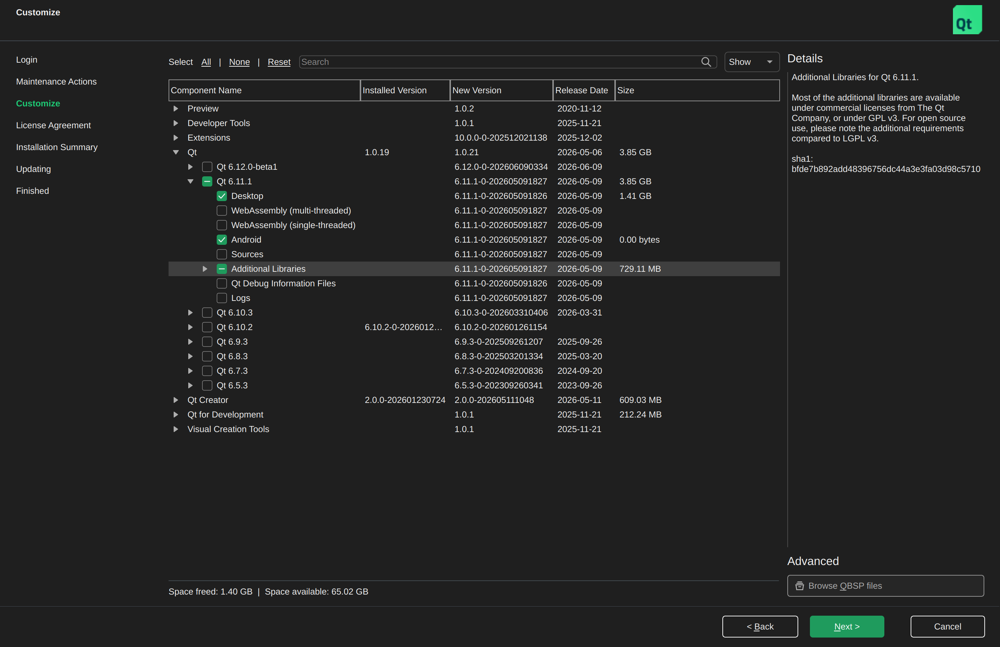
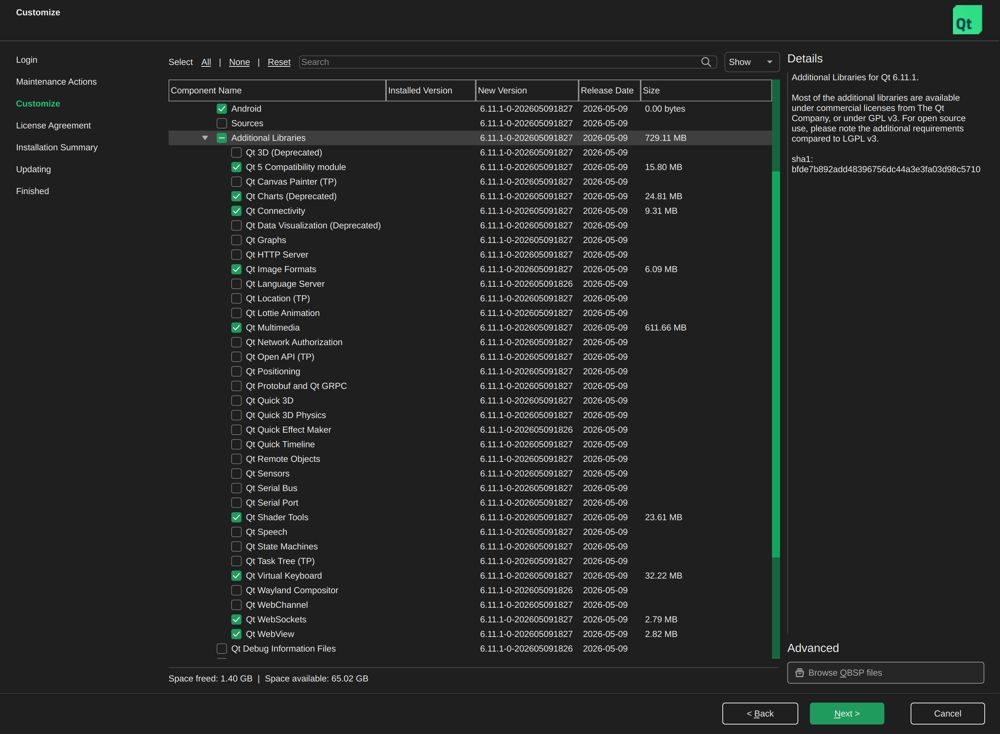

.. _doc-developers-clients-nymea-app-lib:

C++/Qt/QML client library
==========================

nymea:app is structured so that its core logic lives in a standalone Qt library — ``libnymea-app``
— that wraps the entire JSON-RPC API in a Qt-style C++ and QML interface. Other applications can
link against this library to get full nymea connectivity without re-implementing the protocol.

Supported platforms
-------------------

The library builds on any platform supported by Qt. Officially released builds include:

* Linux Desktop
* Windows Desktop
* macOS Desktop
* Android
* iOS
* Ubuntu Touch (Qt 6 port in progress)

Prerequisites
-------------

Qt 6.8 or later is required. The recommended installation method is the
`Qt online installer <https://www.qt.io/download>`__.

In the installer's **Customize** step, select the Qt version and the target platform component
(e.g. *Desktop*). Then expand **Additional Libraries** and enable the following modules:

* Qt Charts
* Qt Multimedia
* Qt Shader Tools
* Qt Virtual Keyboard
* Qt WebSockets

Android
~~~~~~~

Select the Qt base for Android component in the installer. The Android SDK and NDK must also be
installed. See the `Qt for Android documentation <https://doc.qt.io/qt-6/android.html>`__ for
details.

iOS / macOS
~~~~~~~~~~~

Select the iOS or macOS Qt component in the installer. Xcode must be installed. See the Qt
documentation for `iOS <https://doc.qt.io/qt-6/ios.html>`__ and
`macOS <https://doc.qt.io/qt-6/macos.html>`__ for details.

Building
--------

Clone the repository and initialise submodules:

.. code-block:: bash

   git clone https://github.com/nymea/nymea-app.git
   cd nymea-app
   git submodule update --init

The preferred way to build is with Qt Creator: open ``nymea-app.pro`` and click the build button.

To build from the command line, ensure ``qmake`` is on the PATH:

.. code-block:: bash

   qmake /path/to/nymea-app/
   make

The built library is written to ``libnymea-app/`` in the build directory as
``libnymea-app.a`` (static) by default.

Using the library
-----------------

There is no standalone API documentation for ``libnymea-app`` at this point. The QML files in
nymea:app are the best reference for how to interact with the library.

C++/Qt
~~~~~~

Add the include path and linker flags to your project. For a qmake project:

.. code-block:: text

   INCLUDEPATH += /path/to/nymea-app/libnymea-app
   LIBS += -L/path/to/nymea-app-build/libnymea-app -lnymea-app

For CMake:

.. code-block:: cmake

   target_include_directories(mytarget PRIVATE /path/to/nymea-app/libnymea-app)
   target_link_libraries(mytarget PRIVATE /path/to/nymea-app-build/libnymea-app/libnymea-app.a)

QML
~~~

To expose all nymea types to QML, call ``registerQmlTypes()`` before loading the QML engine:

.. code-block:: cpp

   #include <libnymea-app-core.h>

   int main(int argc, char *argv[]) {
       // ...
       registerQmlTypes();

       QQmlApplicationEngine engine;
       engine.load(QUrl(QStringLiteral("qrc:/MyQmlApp.qml")));
       // ...
   }

After that, ``import Nymea 1.0`` is available in QML files.
