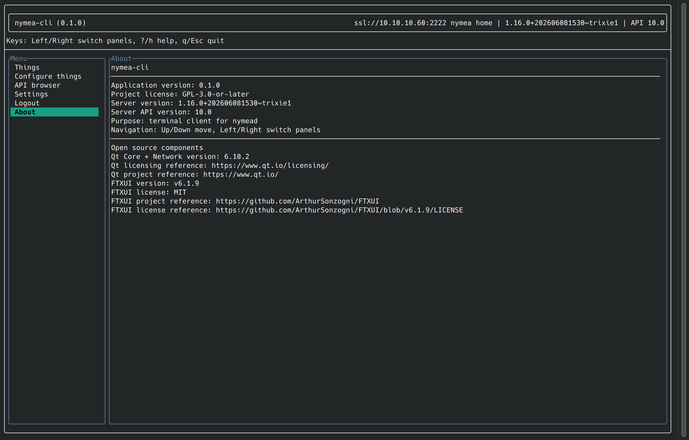
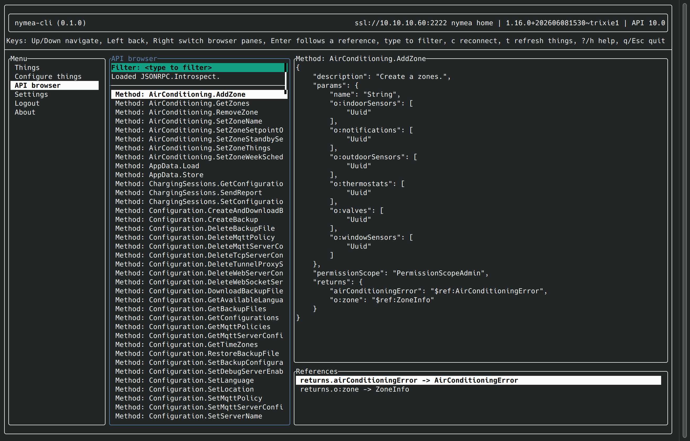

.. _doc-developers-clients-nymea-cli-dev:

nymea-cli
=========

``nymea-cli`` is a terminal application written in C++ with FTXUI. It connects to a nymea:core
instance over the JSON-RPC API and provides an interactive interface for:

* Browsing and monitoring things and their states
* Adding, configuring, and removing things
* Triggering actions and inspecting events
* Managing users and authentication tokens
* Performing system updates

The API browser allows exploring all available JSON-RPC namespaces, methods, and notifications
interactively without writing any code.

The full man page is available in the upstream repository:
`nymea-cli.1 <https://github.com/nymea/nymea-cli/blob/master/docs/nymea-cli.1>`__.

Getting the source
------------------

.. code-block:: bash

   git clone https://github.com/nymea/nymea-cli
