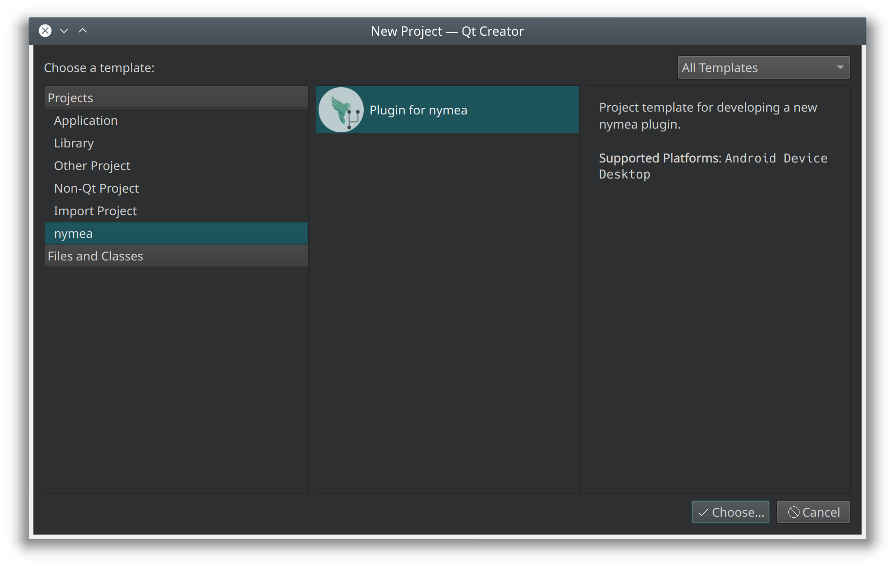
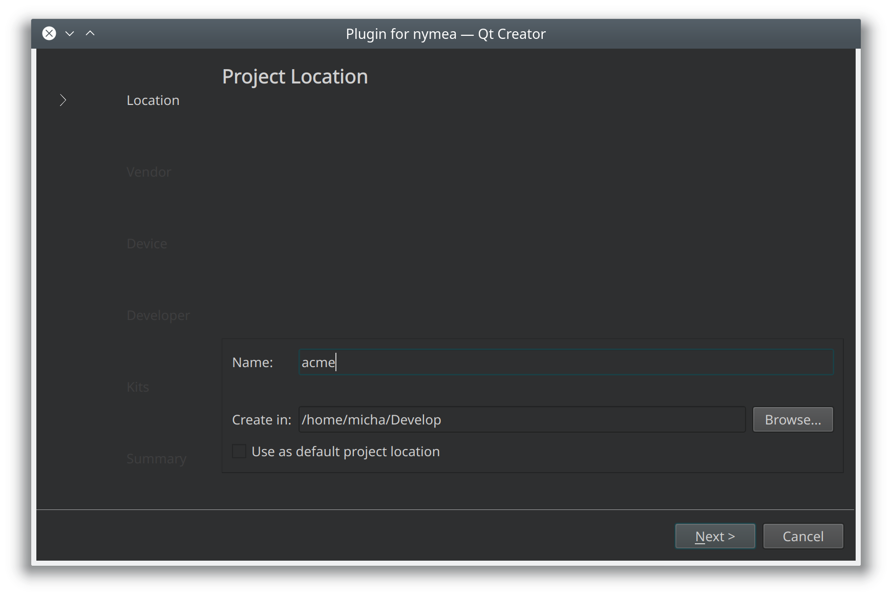
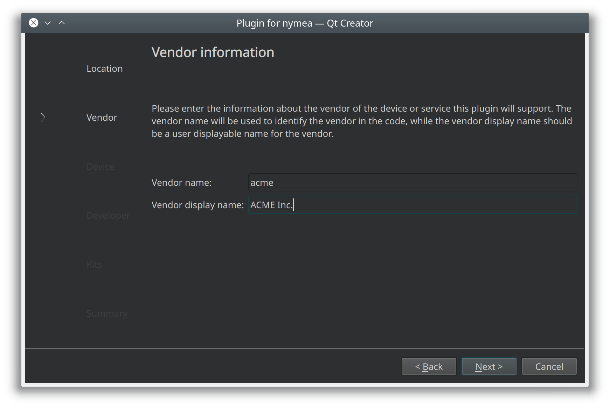
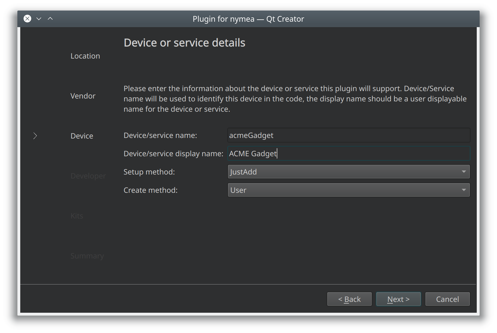
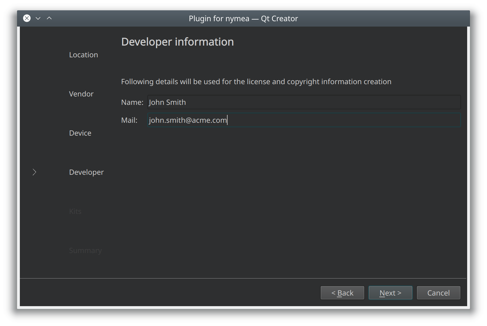
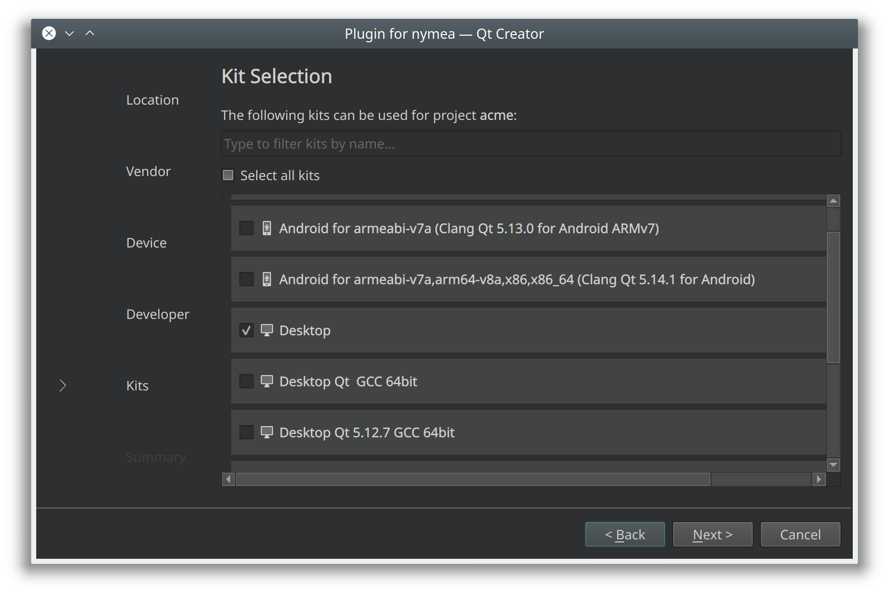

.. _doc-developers-integrations-creating-a-new-plugin:

Creating a new plugin
=====================

QtCreator wizard (C++/Qt only)
------------------------------

The recommended way to start a C++/Qt plugin is the QtCreator project wizard. Go to
**File → New File or Project**, select **nymea** in the project list, then
**Integration plugin for nymea**.

Follow the steps in the wizard. The first step asks for the project location. A plugin integrating
products from a company named "ACME Inc." might use ``acme`` as the project location, which creates
a folder of that name to hold the plugin code.

Enter the vendor information: a **name** (used in code — no spaces or special characters) and a
**display name** (shown to the user, should match the actual company name including punctuation).

Add the first thing class. The same naming convention applies: ``name`` for code, ``displayName``
for the UI.

Enter developer contact details for license headers and copyright notices.

Finally, choose a build configuration. Keeping the default **Desktop** kit is sufficient for
development on a workstation.

Manual project creation
-----------------------

The quickest way to start without the wizard is to clone the examples repository and copy one of
the templates:

.. code-block:: bash

   git clone https://github.com/nymea/nymea-plugin-examples.git

The repository contains a ``templates/`` directory with subdirectories for each supported language.
Copy the template for your chosen language and rename the files accordingly.

**C++/Qt**

.. code-block:: bash

   cp -r nymea-plugin-examples/templates/cpp my-plugin
   cd my-plugin
   mv template.pro myplugin.pro
   mv integrationplugintemplate.cpp integrationpluginmyplugin.cpp
   mv integrationplugintemplate.h integrationpluginmyplugin.h
   mv integrationplugintemplate.json integrationpluginmyplugin.json

**Python**

.. code-block:: bash

   cp -r nymea-plugin-examples/templates/python my-plugin
   cd my-plugin
   mv integrationplugintemplate.py integrationpluginmyplugin.py
   mv integrationplugintemplate.json integrationpluginmyplugin.json

**JavaScript**

.. code-block:: bash

   cp -r nymea-plugin-examples/templates/js my-plugin
   cd my-plugin
   mv integrationplugintemplate.js integrationpluginmyplugin.js
   mv integrationplugintemplate.json integrationpluginmyplugin.json

If a ``.pro`` file is present, open it and update the file names listed there to match the renamed
files.
