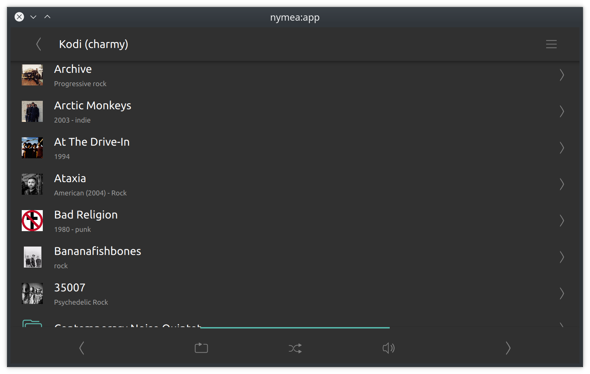
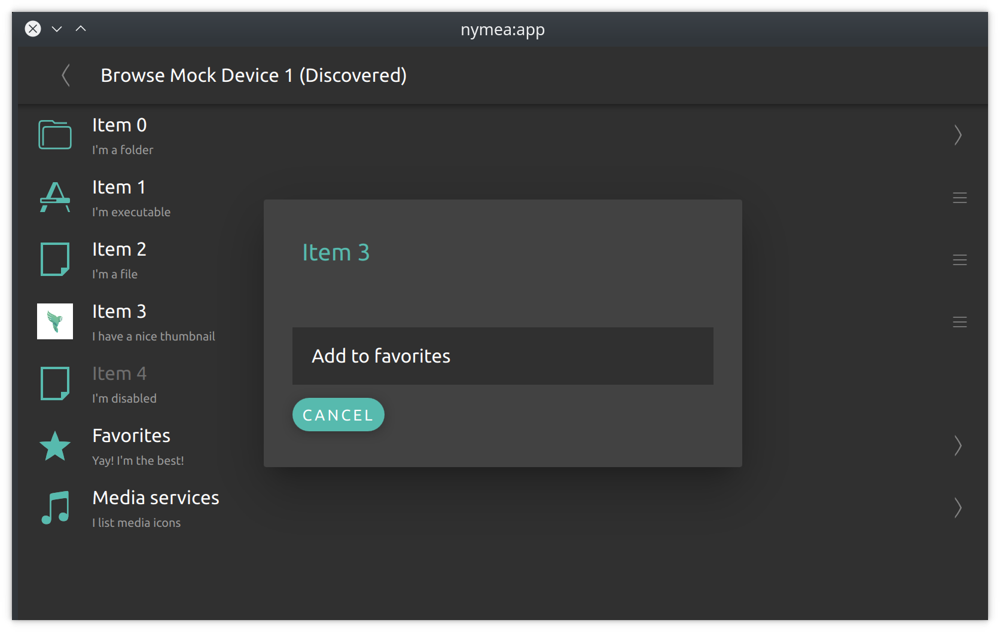

.. _doc-developers-integrations-thing-class:

Thing classes
=============

The thing class describes how a certain thing will look like, what features it offers, and how the
user and the system interact with it. In order to add support for a new device or service to nymea,
a plugin developer creates a thing class to inform nymea about the capabilities of the device or
service. This section lists the available properties of thing classes and explains what they are
used for.

Thing classes are defined using the ``thingClasses`` property in the :doc:`plugin JSON <plugin-json>`
file.

Parameters
----------

A thing class may or may not have parameters. Parameters hold the basic information required to
connect to (or generally use) a device or service. For instance, a thing class describing a device
on the local network might have a parameter for its IP address. A USB device might store the device
ID as presented on the bus. An online service might hold the server URL.

When a thing is configured, nymea (or the user) fills in the parameters and passes them to the
plugin to perform the required setup.

Once set during setup, parameters stay the same for the entire lifetime of the thing. They only
change if the user reconfigures a thing, which amounts to removing it and re-adding it with the
new parameters.

.. note::

   Keep parameters to the minimum set of information required to make the thing usable.

.. note::

   Prefer persistent identifiers over volatile ones. A LAN IP address may change when a DHCP lease
   renews. A better approach is to discover the device via mDNS or UPnP and store a stable device
   ID instead.

Parameters are defined using the ``paramTypes`` property in the :doc:`plugin JSON <plugin-json>`
file and are attached to every thing created in the system. The plugin developer may read them
during :doc:`setup <thing-setup>` or at any later point. If the parameters of a thing change,
setup will be performed again.

Settings
--------

Thing settings are similar to parameters but can be changed at runtime without having to
reconfigure the thing. They allow the user to adjust the behaviour of a thing. Settings must not
affect basic connectivity or impair core functionality.

For example, a Bluetooth device with a small battery might not be able to stay connected
continuously. Such a device might need to be polled. A "polling interval" setting lets users tune
this: once per hour for a soil moisture sensor, much more frequently for a water leak alarm.

Settings are defined using the ``settingsTypes`` property in the :doc:`plugin JSON <plugin-json>`
file. The plugin is notified of changes via the ``settingChanged()`` signal, as described in
:doc:`plugin-code`.

Setup
-----

A set of thing class properties controls how setup works in nymea. When a thing is created, it
walks through a setup flow whose shape depends on the create method and setup method defined in the
thing class. Discovery parameters are also part of the thing class when applicable.

The setup flow is described in detail on the :doc:`thing-setup` page.

Events
------

Things can emit events. For example, a device with buttons triggers a ``buttonPressed`` event
whenever the user presses a button. Events can carry parameters — a remote control's
``buttonPressed`` event would include a parameter indicating which button was pressed.

Events are defined using the ``eventTypes`` property in the :doc:`plugin JSON <plugin-json>` file
and emitted from the plugin as described in :doc:`plugin-code`.

Actions
-------

Actions are the counterpart to events — they go in the opposite direction. A smart speaker might
have ``play``, ``pause``, and similar actions. The user or an automation can execute these to
control the device. Actions can carry parameters too: a notification service action ``notify``
might have ``title`` and ``body`` parameters.

Actions are defined using the ``actionTypes`` property in the :doc:`plugin JSON <plugin-json>`
file and executed by implementing ``executeAction`` in the plugin, as described in
:doc:`plugin-code`.

States
------

States represent properties of a thing that can change over time. For example, a temperature
sensor has a ``temperature`` state updated by the plugin whenever the measured value changes.

Every state change implicitly emits an event that propagates through the entire system.

States can be read-only or writable. A read-only state exposes a value from the device to nymea.
A writable state can also be changed from nymea, which causes nymea to call ``executeAction`` on
the plugin. A writable state always generates a corresponding action automatically.

States are defined using the ``stateTypes`` property in the :doc:`plugin JSON <plugin-json>` file.
Updating and responding to state changes is described in :doc:`plugin-code`.

Interfaces
----------

The ``interfaces`` property of a thing class specifies which standard interfaces it implements.

The main purpose of interfaces is to improve the user experience. Without interfaces, the UI only
knows the raw types of states and actions — it would show a generic switch for a boolean and a
generic slider for an integer. By declaring the ``dimmablelight`` interface, the plugin tells the
UI that this is actually a dimmable light, allowing the UI to render a proper light bulb control
and group it with other lights.

When implementing an interface, the thing class must include at least all states, actions, and
events required by that interface specification. Additional custom states, actions, or events may
be added, and a thing class may implement multiple interfaces.

Implementing as many interfaces as accurately as possible leads to the best user experience.

An interface can extend another. For example, ``light`` requires only a ``powered`` boolean state.
``dimmablelight`` extends it and adds a ``brightness`` state. A thing class implementing
``dimmablelight`` must therefore also satisfy the ``light`` requirements.

The complete list of available interfaces is on the :doc:`interfaces` page.

Generic inputs and outputs
--------------------------

A state can be marked as a generic input or output for cases where the appropriate interface is not
known ahead of time.

A smart plug is a good example. The plugin naturally adds the ``powersocket`` interface. But the
plugin developer cannot know what the user will plug into it. If the user connects a light bulb,
that light won't appear in the lights category because nymea is controlling the plug, not the bulb.
To solve this, the ``power`` state of the plug can be marked as a generic output. The user can then
add a virtual light thing and connect it to the plug — nymea will forward control of the virtual
light to the plug's power state.

The available options are ``digitalInput``, ``digitalOutput``, ``analogInput``, and
``analogOutput``. A digital input can only connect to a digital output (and vice versa), and
likewise for analog.

Generic inputs and outputs are configured via the ``stateTypes`` property in the
:doc:`plugin JSON <plugin-json>` file.

Browsing
--------

Some things offer a browsable content tree. For example, a smart speaker can expose its available
playlists. Browsing works like a file system: it can be a flat list or a full tree.

nymea supports two browser types: file browsers and media browsers. They work the same way; media
browsers additionally carry media-related metadata per entry.

Entries can be executable (can be launched or played) and browsable (can be entered, like a
folder). Each entry can also have a context menu for arbitrary plugin-defined actions.

Browsing is enabled via the ``browsable`` property in the :doc:`plugin JSON <plugin-json>` file and
implemented by overriding the browsing methods described in :doc:`plugin-code`.
