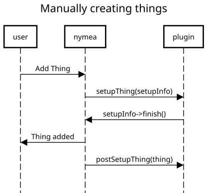
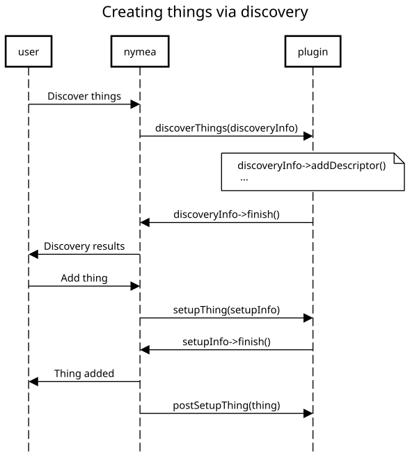
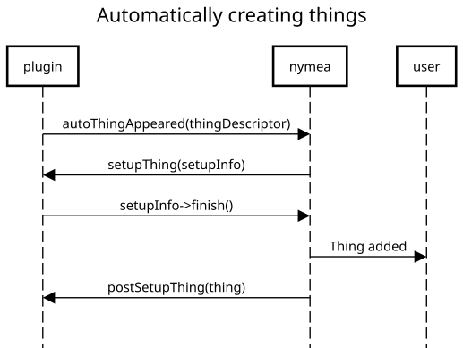
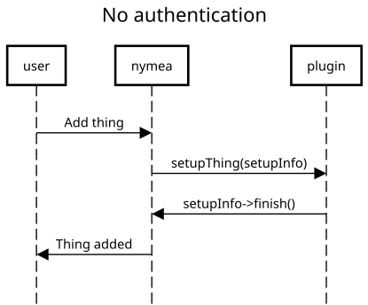
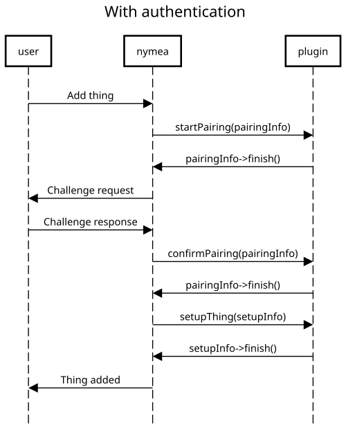
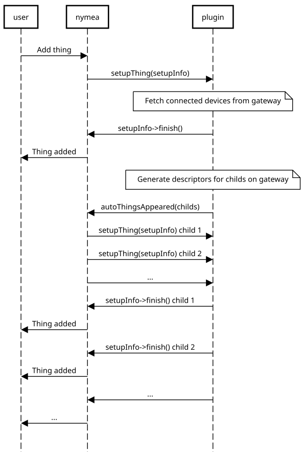
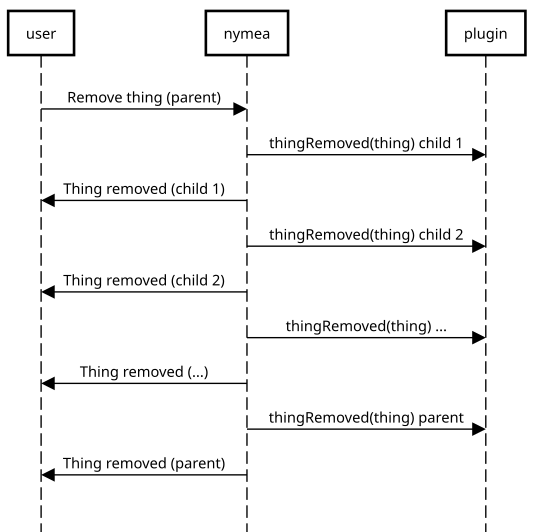
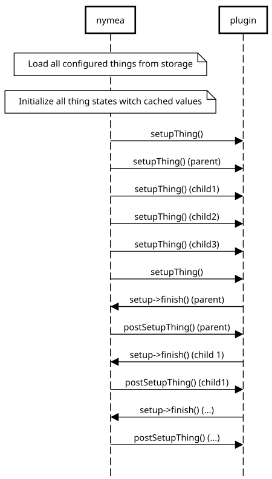

.. _doc-developers-integrations-thing-setup:

Things setup
============

The main purpose of an integration plugin is to allow nymea to connect to services and devices. For that, nymea creates "things" objects which is the main data structure to establish the communication. When a thing is created in nymea, it walks through a setup flow. How this actual flow looks like is depending on the capabilities of a thing class defined in the plugins :doc:`JSON file <plugin-json>`.

However, adding a thing to the nymea system is always done in two steps:

1. Creation

2. Setup

Thing creation
--------------

There are different ways how things can be created in nymea:

User
----

This is used if a thing needs to be configured manually by the user. For example by entering an IP address to connect to it.

Discovery
---------

This is used if a thing can be discovered. For example things that can be found via ZeroConf in the local network. The user can perform a discovery for such things and pick which ones should be added to the system.

Plugins supporting discovery must implement the ``discoverThings`` method.

Automatic
---------

This is used if a device should be added to the system without the user having to interact with it at all. For example, if the user adds a bridge device to the system and then all the devices connected to this bridge will automatically appear in the system.

Plugins supporting automatic thing creation must emit the ``autoThingsAppeared`` signal to indicate the appearance of such things. Also, such plugins plugins may implement ``startMonitoringAutoDevices`` if an entry point for watching things is required.

Thing setup
-----------

Once it is known how a thing can be created in the system, it needs to be set up. Also this offers various options. The simplest form is when a thing does not require any authentication. In this case, the setup flow is as simple as just adding the thing:

In all the other cases, where a thing requires authentication of some sort, the flow will require a challenge response with the user.

JustAdd
-------

This is used for things that do not require any sort of authentication. A user can, after having discovered or manually entered connection parameters for such a thing, just add it to the system and it will be functional.

Username and password
---------------------

If a thing requires entering a username and password for nymea to interact with it, this setup method should be used. It will prompt the user to enter the login credentials upon setup.

Display PIN
-----------

Some things, for example smart TVs will require to use a PIN code for authentication. In this example, the TV will display the PIN to the user on the TV screen and the user can enter it in nymea upon device setup.

Enter PIN
---------

Some things might have an input method (e.g. a number pad) but no display and require the user to enter a PIN on the device. Nymea can display this PIN during device setup and allow the user to enter it on the device.

Push button
-----------

For devices that have a push button it is often required to press this button during setup to grant an authorization token to nymea. Using this setup method will tell the user to press the button during setup and continue once the button has been pressed.

OAuth
-----

Some things, mostly online services, use OAuth to allow the user logging in. Using this setup method will start an out of band login process. During the first step of the pairing, the plugin fetches a OAuth URL from the remote service and redirects the nymea user to this URL. The user then logs in and upon success the user is redirected back to nymea containing the information required to obtain an authorization token.

Examples
--------

In general a plugin implementation can freely combine those create and setup methods to reflect the actual device or service. However, keep in mind that not all combinations of create methods and setup methods make sense. For example things that are added automatically will generally use JustAdd as setup method as they might be created in the system without user interaction at all.

Some example flows:

Create method "User" - setup method "JustAdd"
---------------------------------------------

1. | The user selects "Add new thing" for a thing with create method "User".

2. | The user enters some parameters, for example the IP address of the thing.

3. | The plugin runs setupThing() and connects to the thing using the setup parameters.

Create method "User" - setup method "UserAndPassword"
-----------------------------------------------------

1. | The user selects "Add new thing" for a thing with create method "User".

2. | The user enters some parameters, for example the IP address of the thing.

3. | The plugin runs startPairing() to prepare for pairing.

4. | The user is asked to enter username and password to authenticate for this thing.

5. | The plugin runs confirmPairing() using the given username and password, for example to obtain an authentication token from the thing.

6. | The plugin runs setupThing() and connects to the thing using the setup parameters and the login credentials.

Create method "Discovery" - setup method "JustAdd"
--------------------------------------------------

1. | The user selects "Add new thing" for a thing with create method "Discovery".

2. | The plugin runs discoverThings() and returns a list of discovered things of this type.

3. | The user selects one thing of the discovery results.

4. | The plugin runs setupThing() and connects to the thing using the setup parameters which have been discovered before.

Create method "User" - setup method "PushButton"
------------------------------------------------

1. | The user selects "Add new thing" for a thing with create method "User".

2. | The user enters some parameters, for example the IP address of the thing.

3. | The plugin runs startPairing() and - if needed - indicates to the device that a new pairing is about to happen.

4. | The user is asked to push the button on the hardware.

5. | The plugin runs confirmPairing() to finish the pairing procedure.

6. | The plugin runs setupThing() and connects to the thing using the setup parameters.

Create method "Auto" - setup method "JustAdd"
---------------------------------------------

1. | The user previously added a bridge device in a previous setup flow.

2. | The plugin detects there are multiple devices connected to the bridge.

3. | The plugin emits autoThingsAppeared() to indicate to nymea that new things have been detected.

4. | The plugin runs setupThing() for each of the devices connected to the bridge to set them up without user interaction.

Create method "Discovery" - setup method "DisplayPin"
-----------------------------------------------------

1. | The user selects "Add new thing" for a thing with create method "Discovery", for example a smart TV.

2. | The plugin runs discoverThings() and returns a list of discovered smart TVs of this type.

3. | The user selects one of the discovery results.

4. | The plugin runs startPairing() and instructs the smart TV to display the PIN code.

5. | The user is asked to enter the PIN code displayed on the smart TV.

6. | The plugin runs confirmPairing() using the user entered PIN and requests an authentication token at the TV.

7. | The plugin runs setupThing() and connects to the smart TV using the authentication token obtained before.

Create method "User" - setup method "OAuth"
-------------------------------------------

1. | The user selects "Add new thing" for a thing with create method "User".

2. | The plugin runs startPairing() and obtains the OAuth URL from the remote service which it returns to nymea.

3. | The user is redirected to the OAuth URL and performs the login which returns with a OAuth code.

4. | The plugin runs confirmPairing() and exchanges the OAuth code for a authorization token.

5. | The plugin runs setupThing() and connects to the remote service using the authorization token.

Parent child relationships
--------------------------

Configured things in the system may have parent-child relationships. This is expressed by some things having a parent thing. If a thing does not have any parents it either is a standalone thing or it may be a parent to other things. If a thing does have a parent id set, it is a child of the given parent. One thing can be a parent to many others.

A common case for this is for example a connection to another bridge or an login to an online account. While the bridge or online service represents the parent thing (typically by implementing the ``gateway`` of ``account`` interface), the other devices connected to that gateway
will be represented as childs. Such a flow would typically look similar this:

This parent-child relationship mostly has effect when managing things. If a parent is removed from the system, all its childs will be removed too.

System restarts
---------------

Al the above explains how things are created when the user interacts with the system. However, when nymea is restarted, the setup needs to be performed as well. There is one major difference in that any pairing cannot happen at this point, given there is no user interaction. This means any login information required to re-setup a thing needs to be stored by the plugin.

When starting up, nymea all the previously set up things will be restored like this:

.. note::

   Note that at the point where the first setupThing() for a plugin is called, all the known plugins things will already be loaded. It is safe to check ``myThings()`` in the first ``setupThing()`` call for other things of this plugin.

The ``setupThing()`` method will be called for all the plugins things sequentially. Things without a parent will be set up in no particular order. Things having a parent will always be set up *after* their parent.
