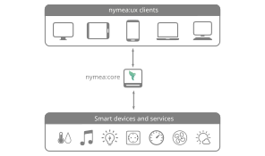

.. _doc-overview-about-nymea:

About nymea
===========

nymea is a local-first IoT and smart-home platform for building connected products, automation gateways and privacy-respecting smart-home systems. It provides the tools, libraries, services and integrations needed to connect devices, expose APIs and automate behavior on a Linux-based edge device.

Because nymea follows a local-first approach, the system can run without a cloud connection and keep data inside the local network. Cloud services are optional and can be used when features such as remote access or push notifications are required.

nymea structure
---------------

nymea consists of nymea:core, nymea:app, optional nymea:cloud services and integration plugins.

nymea:core
----------

nymea:core is the core piece of the platform. It refers to the services and libraries used to build the edge or bridge device where the main software is the nymea daemon or nymead. It can run on any Linux powered device:

  * A typical smart home setup for instance would run a nymea:core on a Raspberry Pi in a home network and talk to IoT devices in the home via WiFi, Bluetooth, ZigBee etc.

  * A smart hot tub for instance would run nymea:core on an embedded Linux device in the hot tub, such as a BeagleBone Black, Raspberry Pi or another SoC, and control the hardware through GPIOs.

See :doc:`nymea:core <../users/installation/core>` for more details.

nymea:app
---------

nymea:app is the user-facing frontend of a nymea system. It is a client app running on a phone, on the IoT edge device itself when it has a display, or on a desktop computer. Please refer to the :doc:`nymea:app <../users/installation/app>` page for more details.

nymea:cloud
-----------

nymea:cloud provides optional services for nymea systems, such as remote access and push notifications. It is not required for local operation; devices, automation and data can remain inside the local network.

Integration plugins
-------------------

Integration plugins connect nymea:core to devices, services and protocols. Plugins define the available things, states, events and actions, allowing nymea to support specific products while still presenting a consistent automation and API model.
