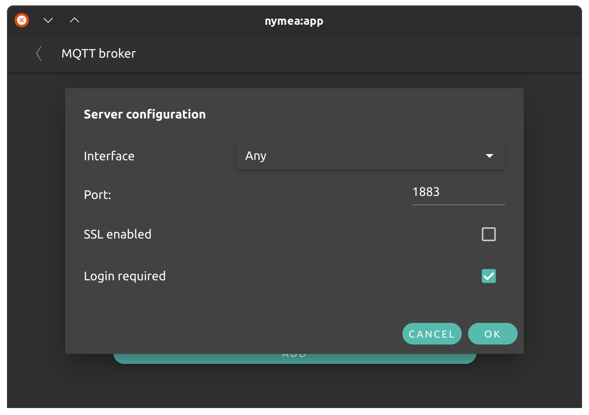
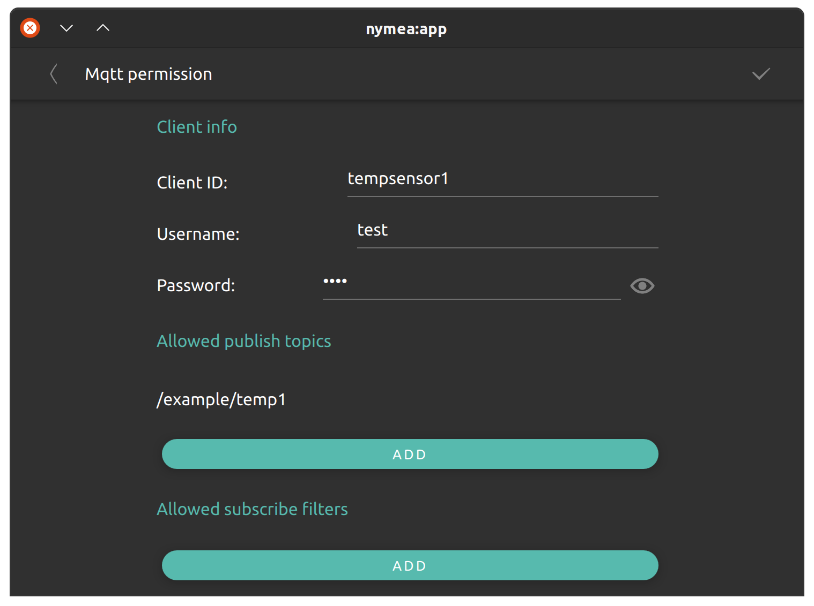
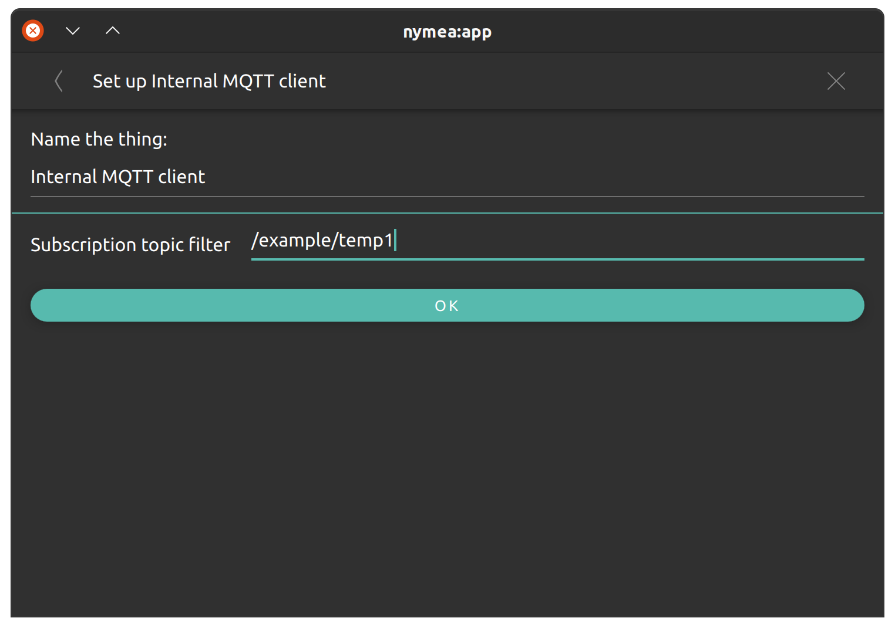
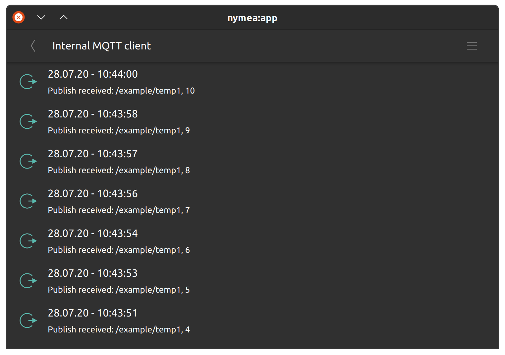
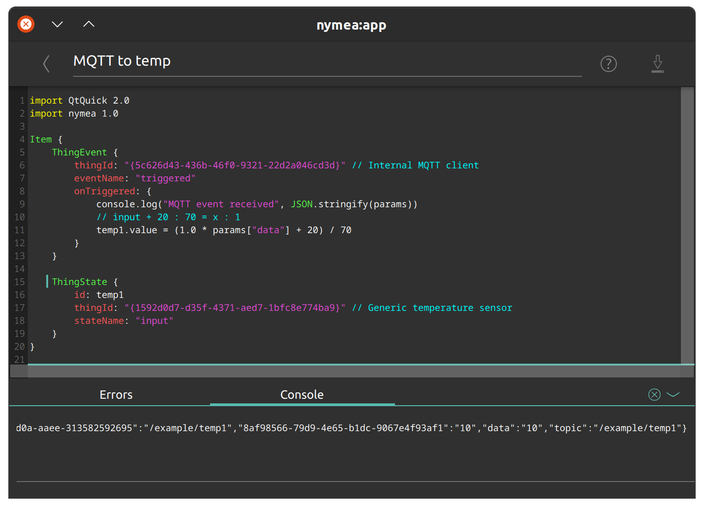
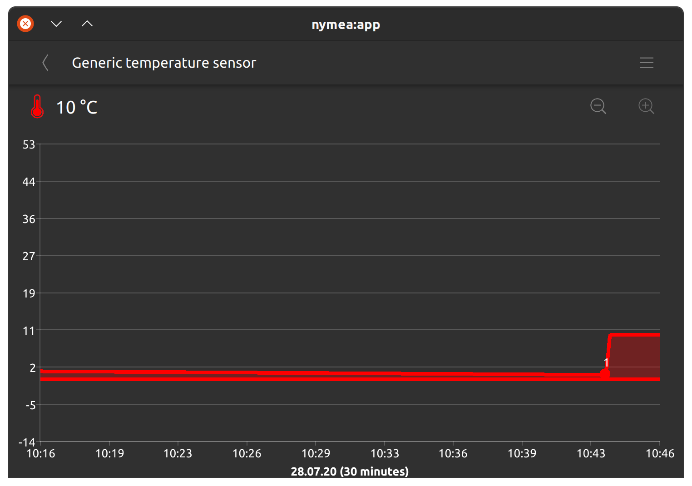

.. _doc-users-advancedusage-sensor-on-mqtt-server:

Publishing sensor values to nymea via MQTT
==========================================

In this example we publish sensor values via MQTT to nymea and attach them to a virtual sensor thing so the data can be shown as a graph.

Assume you have a home-brew weather station which can read temperature sensor values and publish them to an MQTT server. We will connect to nymea over MQTT and post those values to a topic named ``/example/temp1``.

Enabling the MQTT broker
------------------------

First, make sure the MQTT broker in nymea is enabled. For that, open System Settings and go to the MQTT broker section. Make sure there is at least one MQTT server interface enabled. If not, click the "Add" button to add one. Pick the desired interface ("Any" is fine if you are unsure) and a port. MQTT normally uses port 1883. Make sure no other service is already using the port you choose. Enable SSL encryption and/or login if desired. In this example we enable authentication but do not enable SSL encryption.

Create a policy for the client
------------------------------

Because we enabled authentication with the "login required" option above, we need to create a policy to allow the client to log in. This can be skipped if the MQTT server interface was configured without login required.

In the MQTT permissions section, click the "Add" button and fill in the details on the next page. The Client ID cannot be blank, so you can pick any random string. We'll name it ``tempsensor1`` and enter a username and password of ``test`` and ``test``. The next step is to set up permissions for the client on the MQTT broker. We want it to publish to the ``/example/temp1`` topic but we do not want it to subscribe to anything on the server. Remove the default ``#`` entry in the "Allowed publish topics" section and add a new one pointing to ``/example/temp1``. Then remove the default ``#`` entry in the "Allowed subscribe topics" section. For more details on MQTT topic filters, refer to the MQTT documentation.

Connect the client
------------------

Now it's time to test the connection of the client to nymea. In this example we'll be using ``mosquitto_pub`` to publish the values to nymea from another machine:

We'll be using ``-h <ip-of-nymea>`` and ``-p <port>`` to provide the IP address and port of the nymea instance. In our example, nymea is running on the machine with the IP address 192.168.0.200 and we've configured the MQTT server interface to listen on port 1883.

As we've enabled authentication we need to provide the client ID using ``-i``, the username with ``-u`` and the password with ``-P``. In addition to that, we'll be using the topic (``-t``) ``/example/temp1`` and post the message (``-m``) ``10`` to simulate a sensor value of 10 degrees.

::

   $ mosquitto_pub -h 192.168.0.200 -p 1883 -i tempsensor1 -u test -P test -t /example/temp1 -m 10

If this fails with an error, something has gone wrong. For example, if the client ID, username or password are incorrect, it would fail with this error:
::

   Connection error: Connection Refused: identifier rejected.

However, if this command ends without any output, all seems good for now.

Getting logs if things don't work
---------------------------------

If things don't work as expected, we can use the debug interface to check nymea's logs. For that, make sure the debug interface is enabled in System Settings -> Developer tools and open the debug interface in a web browser by navigating to ``http://192.168.0.200:80/debug``. As before, replace the IP with the actual IP of the nymea server.

.. note::

   If you've changed the Webserver port in System Settings -> Webserver, you also need to adjust the port in the URL.

In the debug interface, navigate to the logs tab, enable the MQTT logs and click on "Start logs". Every time you publish something to the MQTT server, this log should appear:

::

    I | Mqtt: Accepting client "tempsensor1" . Login successful.
    I | Mqtt: Client "tempsensor1" connected with username "test" from "192.168.0.201"
    I | Mqtt: Client "tempsensor1" disconnected

Processing the MQTT messages
----------------------------

Now that we're publishing MQTT messages to nymea, we also need to subscribe to the topic in order to receive the values. For that, we'll be using the MQTT client plugin.

Go to Configure Things and press the ``+`` button to add a new thing. Select the "Internal MQTT client" thing.

.. note::

   You may need to install ``nymea-plugin-mqttclient``. See :doc:`installing more plugins <../usage/things>` for details.

On the next page, enter the desired topic to subscribe to. In this example that is again ``/example/temp1``. Once done, click OK.

Returning to the main view of the app, we'll find a new category named "Incoming events". Open it and you'll see the incoming events from the MQTT server in the topic ``/example/temp1``.

Now send a MQTT message again with mosquitto_pub and you'll find the message appearing in this log.

Congratulations, you've now captured an MQTT sensor event in nymea. This is still not as useful as we'd like it to be, though. We want it to look like a proper temperature sensor.

Presenting the data as a temperature sensor
-------------------------------------------

For this, add another thing to the system using "Configure Things -> ``+``". This time we'll pick a "Generic Temperature Sensor". The sensor will appear in the app, but its value is not updated yet. One last piece is missing: we need to process the MQTT message, extract the sensor value and feed it into the generic sensor.

Enter the "Magic" section in the app and navigate to the scripting toolbox with the icon on the upper right. Create a new script using the ``+`` button.

.. note::

   For more information on nymea scripts, refer to the :doc:`nymea scripting <../usage/scripting>` section.

In the script we first need to fetch the events from the MQTT client by adding this snippet:

::

   ThingEvent {
       thingId: "..." // Internal MQTT client
       eventName: "triggered"
       onTriggered: {
           console.log("MQTT event received:", JSON.stringify(params));
       }
   }

Now deploy the script to nymea but don't exit the script editor yet. If you now use mosquitto_pub to send the event again, the script console will pop up printing this message:

::

   MQTT event received {"27ec8baf-0c13-4d0a-aaee-313582592695":"/example/temp1","8af98566-79d9-4e65-b1dc-9067e4f93af1":"18","data":"18","topic":"/example/temp1"}

Now we can see the payload of the MQTT message in the ``data`` field of ``params``. We can access it using ``params["data"]``.

Next thing is to feed that value into the Generic Temperature Sensor thing using such a script snippet:

::

   ThingState {
       id: temp1
       thingId: "..." // Generic Temperature Sensor
       stateName: "input"
   }

All generic things have an input state which takes floating-point values from 0 to 1. The generic temperature sensor will calculate the temperature using this input value by mapping it to the minimum and maximum range defined in its settings. By default this is from -20 C to +50 C. This means we need to generate an input value ranging from 0 to 1, which represents temperature sensor values from -20 C to +50 C. We can do this with the simple formula ``(parseFloat(params["data"]) + 20) / 70``. So let's extend the first snippet to transform the value and write it to the generic sensor thing:

::

   ThingEvent {
       thingId: "..." // Internal MQTT client
       eventName: "triggered"
       onTriggered: {
           console.log("MQTT event received:", JSON.stringify(params));
           temp1.value = (parseFloat(params["data"]) + 20) / 70
       }
   }

The final script would look something like this:

And we're done. Now, whenever you send something to nymea with ``mosquitto_pub``, it will update the temperature sensor.

You can adjust the formula above according to your liking. For instance, if your MQTT client can only send JSON, you will get the entire JSON message in the ``data`` parameter and can unpack and extract relevant information using ``JSON.parse()``. Or if your input sensor uses a different mapping, for example it sends values from 1 to 10, you can adjust the formula accordingly.
