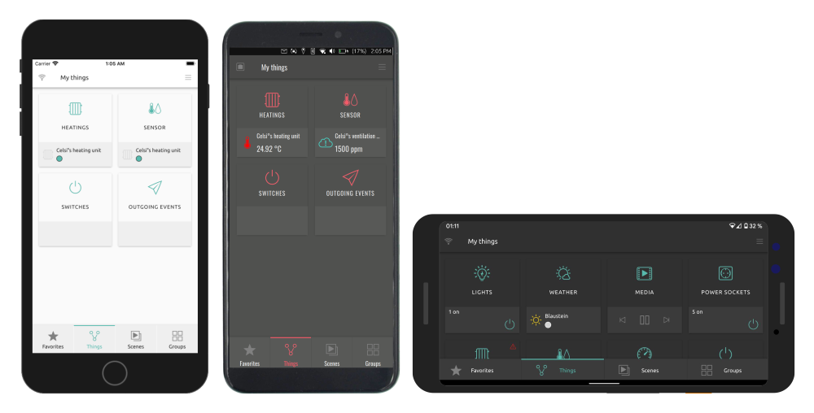
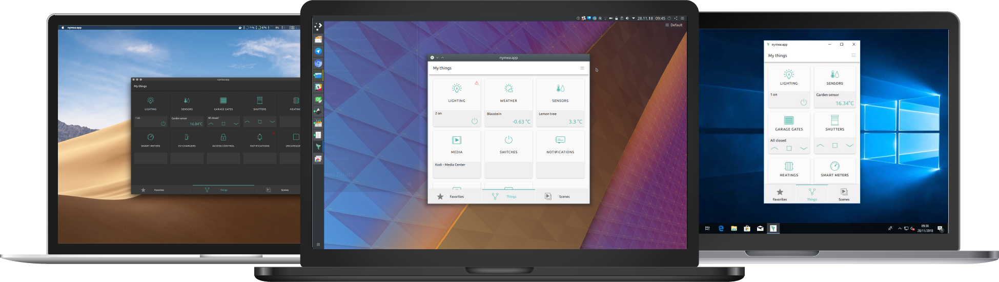

.. _doc-users-installation-app:

nymea:app
=========

The typical use case for nymea:app is to be installed on the user's mobile device, with optional
additional installations on laptops, desktop PCs and wall-mounted or centrally placed touch screens.

Smartphones and tablets
-----------------------

nymea:app can be found in the Google Play Store for Android and in the Apple App Store for iOS.

.. raw:: html

   

   
   
   

Supported mobile platforms:

* iOS

* Android SDK 23 or greater

Laptops and Desktops
--------------------

For Windows, nymea provides an offline installer from the downloads section. For Linux systems, use the
nymea apt repository as described in the :ref:`Debian GNU/Linux and Ubuntu <doc-users-installation-core-debian-ubuntu>` section.

.. raw:: html

   

   
   

.. raw:: html

   

   
   

.. note::

   macOS App Store submission is planned for a future release.

Supported desktop platforms:

* Windows 10 or greater

* macOS 12 or greater

* Debian 13 ("trixie")

* Ubuntu 26.04 ("resolute")

.. note::

   Please note that installing the app from the downloads section requires manually downloading newer
   versions for updates. At this point, we are not providing a package for the Windows app store.

Embedded devices and manual setups
----------------------------------

nymea:app can also be installed from the same package repository as nymea:core.

Currently, these versions are officially supported:

Debian:

* Debian 13 ("trixie")

Ubuntu:

* Ubuntu 26.04 ("resolute")

For each of the repositories the following architectures are provided:

* amd64

* armhf

* arm64

* riscv64

To enable the repository, create a file named ``/etc/apt/sources.list.d/nymea.sources``:

.. code-block:: bash

   sudo tee /etc/apt/sources.list.d/nymea.sources > /dev/null <<EOM
   Types: deb deb-src
   URIs: http://repository.nymea.io
   Suites: trixie
   Components: main non-free
   Signed-By: /etc/apt/trusted.gpg.d/nymea.gpg
   EOM

For Ubuntu, replace ``trixie`` with ``resolute``.

The packages in the nymea repository are signed with nymea's GPG key, which can be imported by running:

.. code-block:: bash

   sudo curl -fsSL -o /etc/apt/trusted.gpg.d/nymea.gpg https://repository.nymea.io/repository.gpg

Optionally, the keys fingerprint can be verified with:

.. code-block:: bash

   gpg --show-keys --with-fingerprint /etc/apt/trusted.gpg.d/nymea.gpg

.. code-block:: text

   pub   rsa4096 2016-04-08 [SC]
         B1C8 9C2A E70D 2FC8 27DF  0BFF 457A 6EE4 A1A1 9ED6
   uid                      nymea GmbH <developer@nymea.io>
   sub   rsa4096 2016-04-08 [E]
   sub   rsa4096 2016-04-08 [S]

Once done, update the package index and install nymea:app:

.. code-block:: bash

   sudo apt update
   sudo apt install nymea-app

Once this command completes, nymea:app should be installed and ready to use from the applications menu.

Joining the beta tests
----------------------

.. note::

   Running experimental or testing builds of nymea is not recommended for users expecting a stable setup.

In order to help with testing pre-releases of nymea or give early feedback on features which are still in development, it is possible to join the beta program for nymea:app.

* For Android, join the `Beta in the Google Play Store <https://play.google.com/apps/testing/io.guh.nymeaapp>`__

* For iOS, join the `TestFlight builds <https://testflight.apple.com/join/Y5MifPpT>`__

* For other platforms, find beta builds on the `downloads server <https://downloads.nymea.io/nymea-app/>`__
