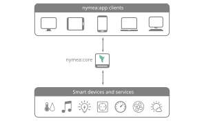

.. _doc-users-installation-getting-started:

Getting started
===============

A nymea setup consists of two parts:

* :doc:`nymea:core <core>`: the local server and gateway that runs continuously in the network.
* :doc:`nymea:app <app>`: the client used to configure and control nymea:core.

Install nymea:core first, then install nymea:app on one or more phones, tablets or desktop systems. Both
can run on the same device, but most setups run nymea:core on a Raspberry Pi, gateway or small PC and use
nymea:app from other devices.

After installation, continue with :doc:`the first steps guide <../usage/first-steps>`.
