.. _doc-users-usage-configuration:

Configuration
=============

nymea configuration happens in nymea:app. The main menu has two sections: "System settings" and "App settings". System settings contains all the settings that affect nymea:core, while App settings contains the configuration for the particular app client being used.

System Settings
---------------

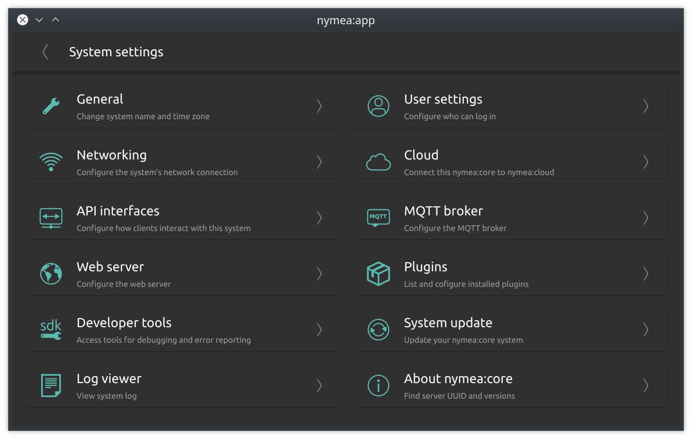

General
-------

The general settings section allows you to configure the name used for this nymea system, as well as the time and timezone settings.

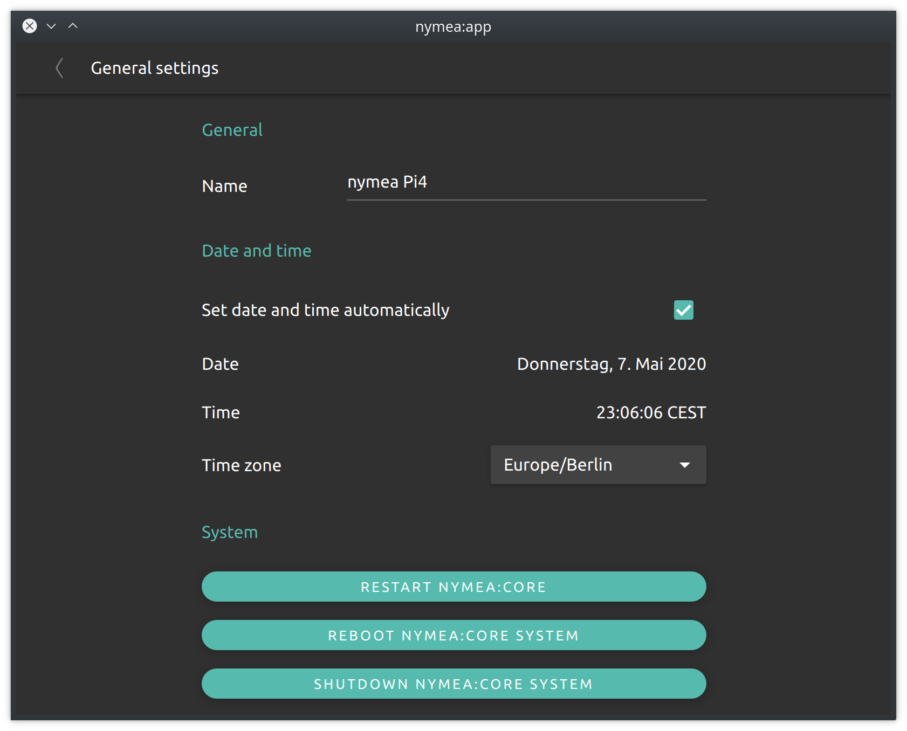

Name
----

The name will be used whenever the nymea system announces itself on the network. This is useful if there is more than one nymea system in a network and you need to identify them.

Date and time
-------------

Date and time sets the date and time on the nymea:core system. By default this is set to automatically obtain the current date and time from the internet. If that is not possible, for example because the nymea system is used without an internet connection, the automatic time setting can be disabled and the time can be set manually.

User settings
-------------

In the user section the current password can be changed and authenticated clients can be locked out.

.. note::

   This section will only be available if nymea:core is configured to require authentication.

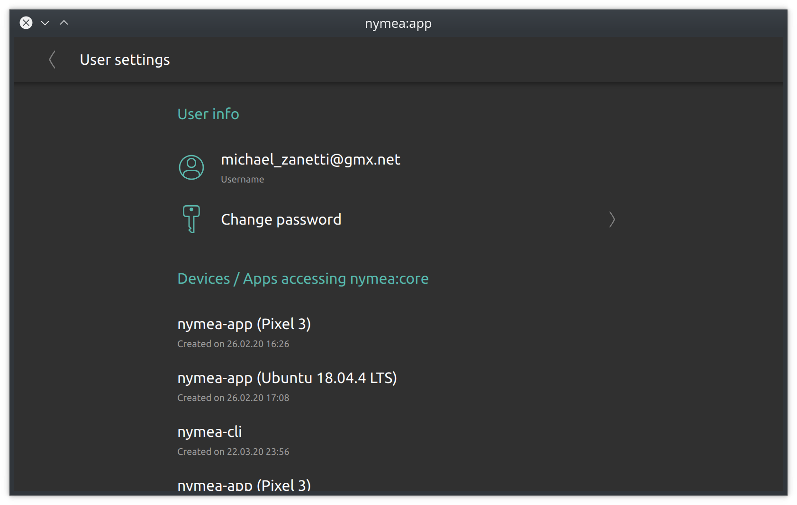

User info
---------

Tapping the "Change password" field allows you to change the current password.

Devices/Apps accessing nymea:core
---------------------------------

This list holds all the clients that have successfully authenticated to this nymea system. If a device has been stolen or lost, the authentication token can be removed here. That locks out this particular device and forces it to authenticate again before accessing the system. Swipe or long-press an entry to reveal the delete button.

Network settings
----------------

The networking section allows you to configure network connectivity for the nymea:core system.

.. warning::

   Using incorrect configuration settings might prevent clients from connecting to the nymea:core system.

When using hardware with both wired and wireless networking available, such as a Raspberry Pi 3 or 4, a good choice is to connect nymea to the local network using a cable and at the same time use the wireless interface to host an access point. That lets wireless IoT devices connect directly to the nymea system without joining your private network.

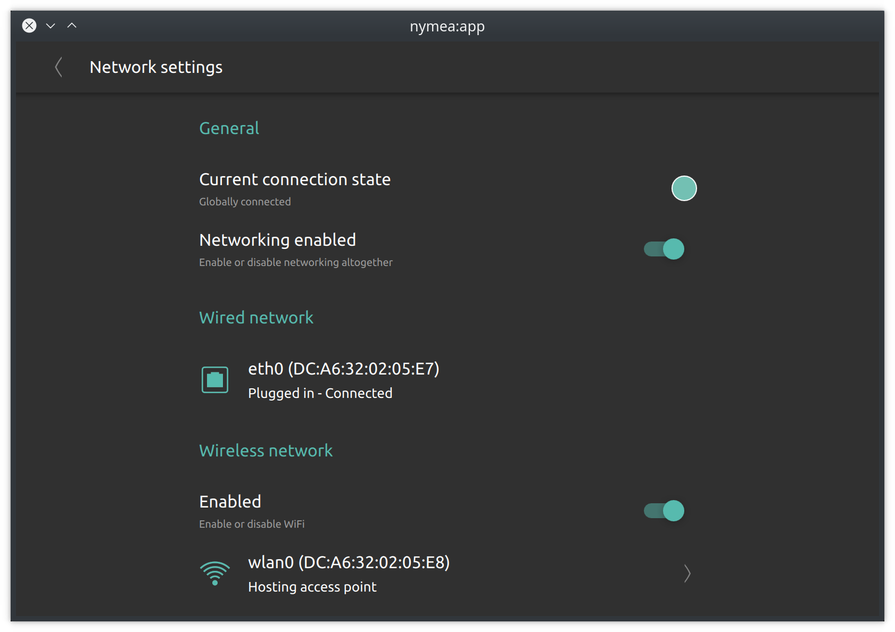

General
-------

The general section allows you to completely disable networking.

Wired network
-------------

The wired connection setup lists all available wired network interfaces of the nymea:core system.

Wireless network
----------------

The wireless connection setup allows you to control the wireless network interfaces of the nymea:core system. Using this section, the nymea:core system can be connected to a wireless network or can host an access point.

Connection settings
-------------------

The connection settings section allows you to configure which ports clients can use to connect to this nymea:core system.
By default, a nymea:core system can be reached from the local network. If you also want to connect to your nymea system remotely, the remote connection can be enabled here. This will cause nymea:core to connect to a proxy server on the internet and listen for incoming connections from nymea:app. The proxy server does not store any of your data, it only forwards traffic between nymea:app and nymea:core.

.. note::

   Please make sure your user passwords are strong enough to not be guessed easily when enabling the remote connection.

nymea uses port 2222 for local network connections. If you have special requirements and want to change that, open the Connection interfaces settings from here.

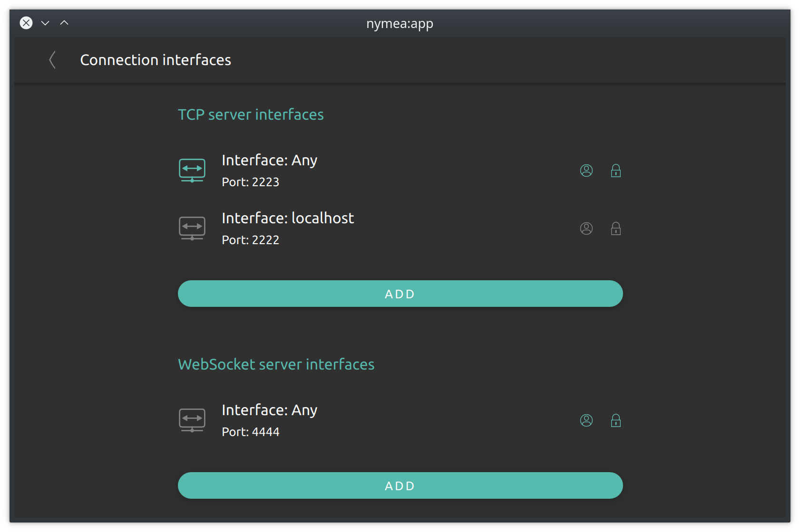

For usage with nymea:app, TCP or WebSocket transports work equally well. Due to the overhead that comes with WebSocket compared to a TCP socket, TCP would perform slightly better. When using clients other than nymea:app, for example a self-made script, it might be easier to connect using WebSocket because it is well supported in web browsers.

This section also allows you to configure SSL encryption per connection interface. It is strongly advised to keep both SSL encryption and authentication enabled. However, when using clients that do not support SSL encryption it can be disabled here. Each interface can be configured to listen only to localhost connections (useful for scripts or nymea-cli on the nymea:core system), to any network interface or only to a particular network interface.

Swipe an entry to the left or long-press on it to reveal the remove button and disable it.

.. note::

   Note that removing the connection interface currently used will disconnect the connection immediately. The currently used connection interface is shown via the highlighted icon.

MQTT broker
-----------

nymea features an integrated MQTT broker. This section allows you to configure it.

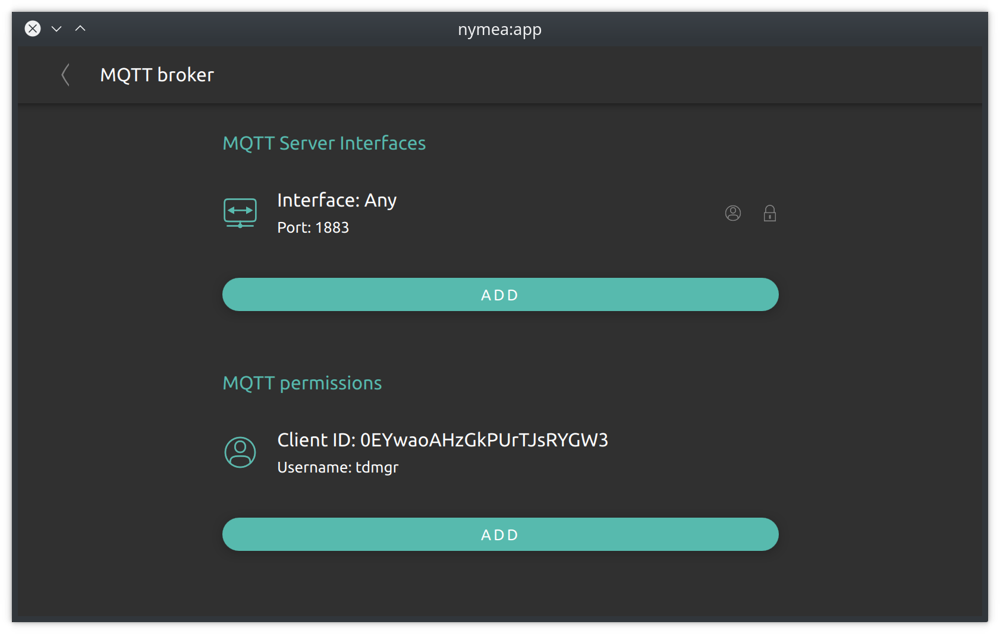

MQTT server interfaces
----------------------

Similar to the Connection interfaces, this section allows you to configure all the network interfaces and ports where the MQTT broker should be available. For each interface and port, SSL encryption and authentication can be enabled or disabled. Long-press or swipe left to remove an interface. In order to use integration plugins that use MQTT, at least one MQTT server interface must be enabled.

MQTT permissions
----------------

When authentication is enabled on an MQTT server interface, a permission needs to be created in order to allow third-party MQTT clients to connect to the MQTT broker. MQTT permissions are defined by a client ID, a username, a password and the topics this client should be allowed to connect to.

.. note::

   Note that this is not required for integration plugins using MQTT. Integrations can grant permissions to clients automatically by generating a permission specifically for the particular use case.

ZigBee
------

The ZigBee section allows to manage ZigBee networks within nymea. In order to use ZigBee with nymea, a ZigBee adapter is required.

Supported ZigBee adapters
-------------------------

The following hardware adapters are supported:

* `Texas Instruments <https://www.ti.com/product/CC2652R>`__

  This adapter can be found in various shops, either without firmware or pre-flashed. A z-Stack based firmware is required on the adapter to work with nymea. When choosing an option, select the firmware for zigbee2mqtt which will work fine with nymea (zigbee2mqtt is not required) or manually flash the stick with a build of z-Stack.

  * CC2652 (P/R/RB) - recommended option (e.g. the `slae.sh <https://slae.sh>`__ or `Sonoff ZigBee 3.0 USB - Dongle-P <https://sonoff.tech/product/gateway-amd-sensors/sonoff-zigbee-3-0-usb-dongle-plus-p/>`__). V2/Dongle-E is *not* supported.

  * CC253x

* `Dresden Elektronik <https://www.dresden-elektronik.de/>`__

  All phoscon models are supported, however, only ConBee can be auto-detected. Select baud rate 38400 for RaspBee modules during ZigBee network setup.

  * `ConBee <https://phoscon.de/en/conbee>`__

  * `ConBee II <https://phoscon.de/en/conbee2>`__

  * `RaspBee <https://phoscon.de/en/raspbee>`__

  * `RaspBee II <https://phoscon.de/en/raspbee2>`__

* `NXP ZigBee 3.0 Modules <https://www.nxp.com/pages/jn516x-7x-zigbee-3-0:ZIGBEE-3-0>`__

  NXP based adapters are supported, provided they are flashed with the nymea firmware.

  * JN5168

  * JN5169

Setting up a ZigBee network
---------------------------

With the ZigBee adapter connected to the nymea system, a new ZigBee network can be created from System Settings -> ZigBee. Multiple ZigBee adapters may be used to create multiple separated ZigBee networks.

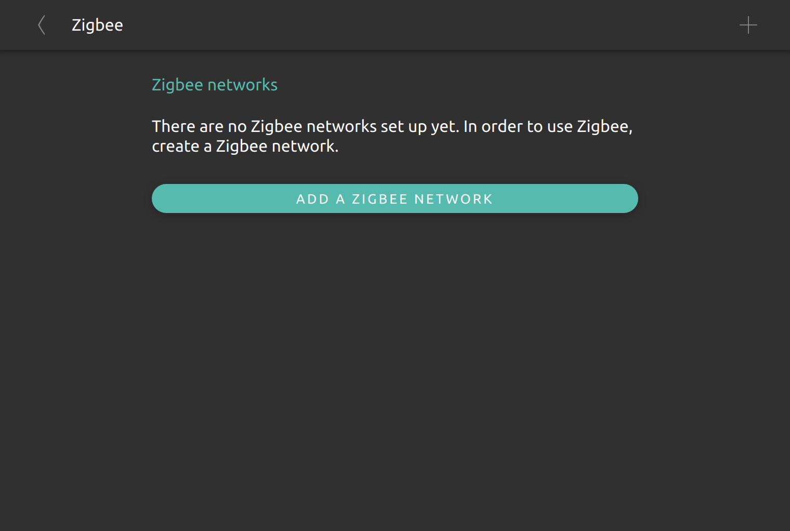

Since most ZigBee modules are based on UART communication, the hardware cannot always be auto-detected. Some hardware modules (USB based like ConBee II) can be identified and recognized automatically, other modules based on raw UART connections like the JN5168 or RaspBee II need to be added and configured manually.

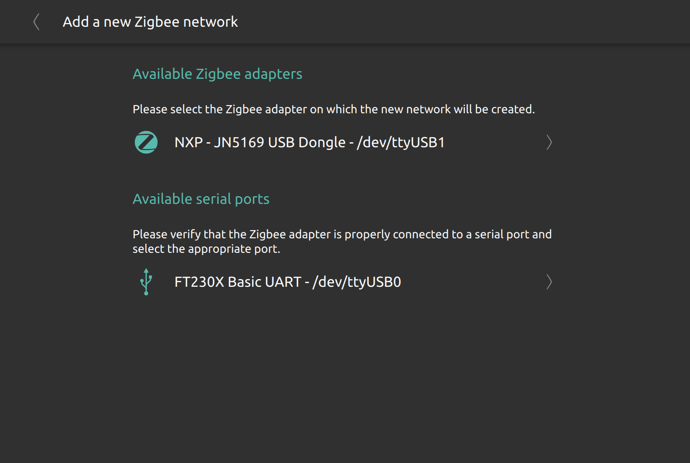

When adding a new ZigBee network in nymea, available UART ports can be listed. If a module can be auto-detected, all the UART information will be pre-filled, else it needs to be provided when configuring the ZigBee network.

If a module does not get recognized due to missing hardware information (like JN5168 or ConBee 1 / RaspBee 1), the user has to select the UART port, the backend type to use and the baud rate for this hardware type.

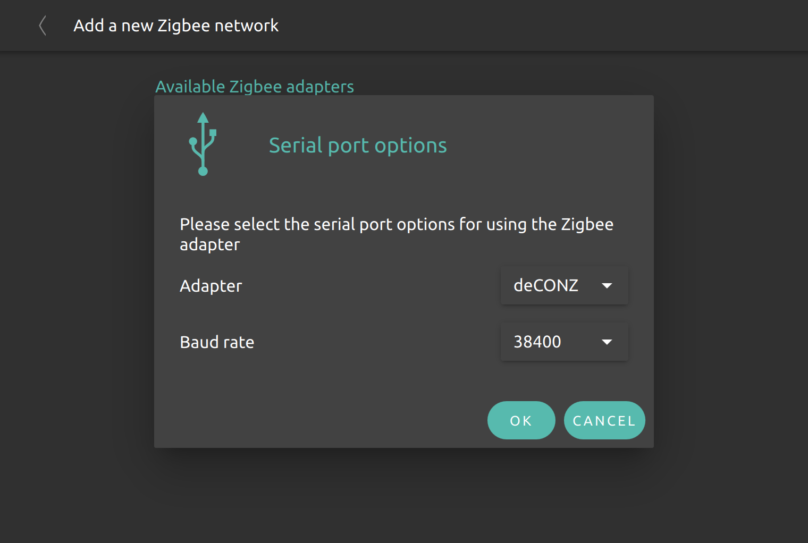

Adding new ZigBee devices
-------------------------

In order to add a new ZigBee device into a nymea managed network, the network needs to be opened for allowing new nodes to join the network. The default open time window is 120 seconds, but it can be extended if required or closed immediately if desired.

Once the network is open, the pairing procedure of the ZigBee device can be started and the node will join the network. Initiating the pairing procedure on the device may vary between different devices and manufacturers. Please refer to the manual of the device to learn how to start the pairing procedure.

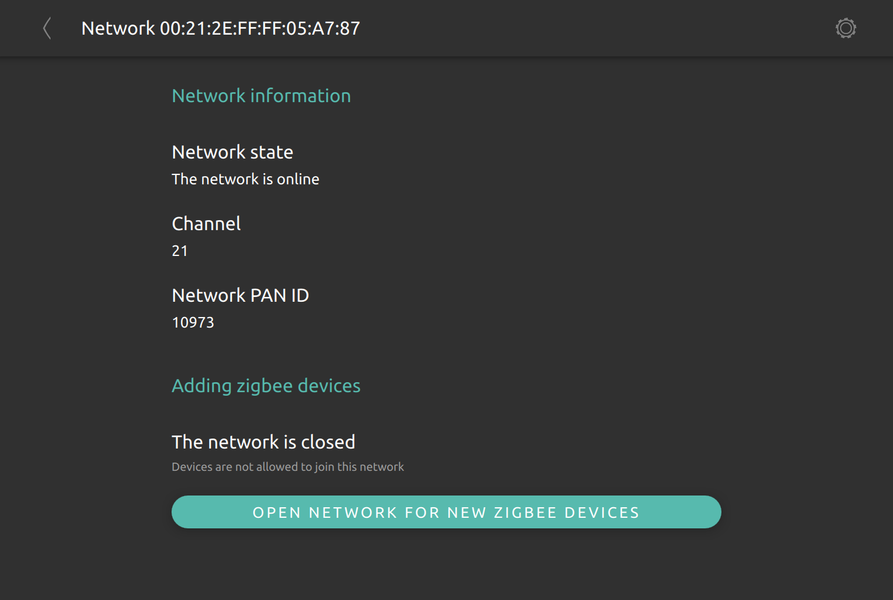

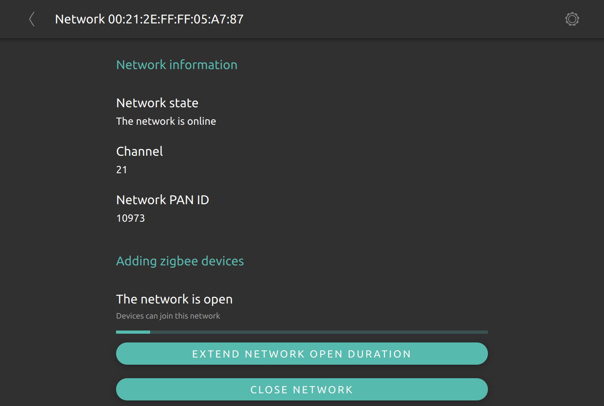

If nymea recognized the ZigBee node, a new thing will show up automatically in the system and is ready to use. If a ZigBee node appears but is listed as unrecognized device, an appropriate nymea integration plugin may be required.

The list of supported ZigBee integration plugins can be found `here <https://nymea.io/documentation/resources/integrations/?technology=zigbee>`__.

.. note::

   Installing the meta package ``nymea-plugins-zigbee`` will install all available ZigBee integrations and is recommended for most users.

Removing a ZigBee device
------------------------

In order to remove a ZigBee node from the network, there are two possible options:

* **Remove related thing**: If the ZigBee node has been recognized and a device has been created for the node, the device can be removed from the network by removing the thing from the system.

* **Restart pairing process**: Some device can also be removed from a network by restarting the pairing process, while the network is closed. Not all backends support this feature.

Removing / Resetting a ZigBee network
-------------------------------------

In order to remove an entire network and all related things within nymea, there are two possibilities.

* **Removing the network**: By removing the network, the UART will be free again for other software to use and all ZigBee nodes, settings and related things will be removed permanent from the system.

* **Factory reset network**: By factory resetting a network, all nodes and related things will be removed from the network. If the backend supports it, also all configuration on the ZigBee hardware will be wiped. The entire stack performs a restart and will start a new network, perform a new channel scan and pick a new network ID.

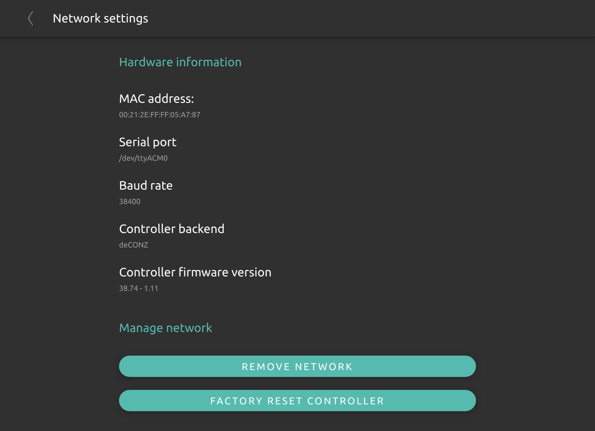

Z-Wave
------

The Z-Wave section allows to manage Z-Wave networks within nymea. In order to use Z-Wave with nymea, a Z-Wave adapter is required.

Supported Z-Wave adapters
-------------------------

Pretty much all Z-Wave adapters should work with nymea, given Z-Wave uses a standardized protocol. However here's a list of well tested and known to work adapters. Please report any known to work adapters to nymea so this list can be updated.

* `Aotec <https://aeotec.com/>`__

  * `Aeotec Z-Stick Gen5 <https://aeotec.com/products/aeotec-z-stick-gen5/>`__: This adapter is also sold as other brands such as the Zooz S2 USB controller.

* `Z-Wave.Me <https://z-wave.me/>`__    

  * `RaZberry <https://z-wave.me/products/razberry/>`__

Setting up a Z-Wave network
---------------------------

With the Z-Wave adapter connected to the nymea system, a new Z-Wave network can be created from System Settings -> Z-Wave. Multiple Z-Wave adapters may be used to create multiple separated Z-Wave networks.

Adding new Z-Wave devices
-------------------------

In order to add a Z-Wave device into a nymea managed network, enter the network settings and press the "Add device" button. Once the network is waiting for the new device to join, the pairing procedure of the Z-Wave device can be started and the node will join the network. Initiating the pairing procedure on the device may vary between different devices and manufacturers. Please refer to the manual of the device to learn how to start the pairing procedure.

If nymea recognized the Z-Wave node, a new thing will show up automatically in the system and is ready to use. If a Z-Wave node appears but is listed as unrecognized device, an appropriate nymea integration plugin may be required.

The list of supported Z-Wave integration plugins can be found `here <https://nymea.io/documentation/resources/integrations/?technology=z-wave>`__.

.. note::

   Installing the meta package ``nymea-plugins-zwave`` will install all available Z-Wave integrations and is recommended for most users.

Removing a Z-Wave device
------------------------

In order to remove a Z-Wave node from the network, enter the Z-Wave settings and press the "Remove device" button. Once the network is waiting for the device to leave, initiate the pairing procedure on the device.

Removing / Resetting a Z-Wave network
-------------------------------------

Z-Wave networks can be removed from nymea. This, however, will not reset the configuration of the Z-Wave controller. A network can be removed from one nymea instance and transferred to another simply by removing it and creating it again on a different instance.

In order to permanently remove the Z-Wave network from the controller, the "Factory reset controller" button may be used from the Z-Wave network settings. Please note that all devices connected to the Z-Wave network need to be factory reset in order to connect to another Z-Wave network again.

Web server
----------

Nymea features an integrated web server. The web server is used to host the `nymea debug interface <#debug-interface>`__ but can also be used to host any website.

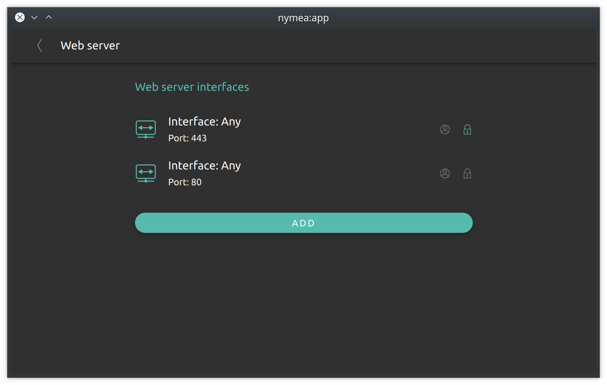

In order to use the debug interface, at least one web server interface needs to be enabled. Similar to the connection interfaces, SSL encryption and authentication can be enabled for each web server individually. When adding a server interface, the path to a website located on the nymea:core system can be provided.

.. note::

   At this point nymea does not support server-side code execution like php or similar.

Modbus RTU
----------

The modbus RTU section allows to manage RS485 interfaces within nymea. In order to use modbus RTU integration plugins in nymea, a RS485 adapter (USB) or an internal RS485 serial port is required.

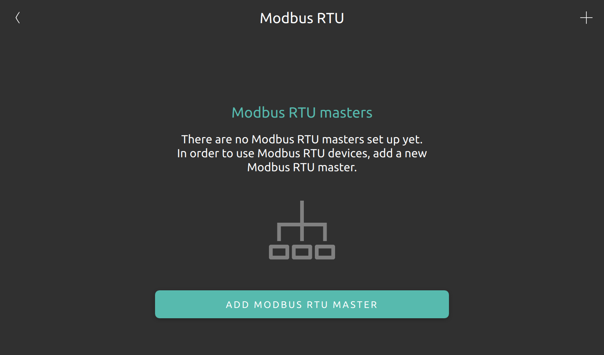

Configure a new modbus RTU master
---------------------------------

In order to add a new modbus RTU master the server offers you the available internal and external connected (i.e. USB adapters) interfaces for communicating modbus RTU slaves.

.. note::

   In this example you can see one available internal RS485 serial port.

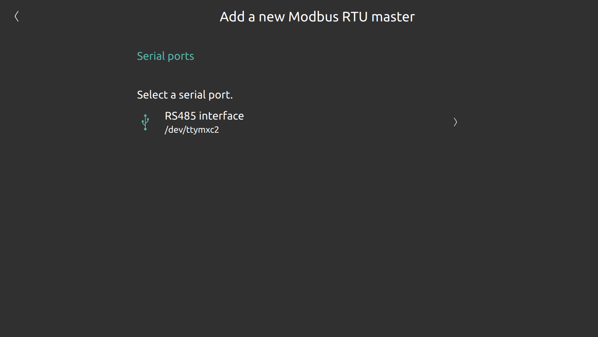

Once you select the port you want to use as modbus RTU resource you can specify the port configurations.

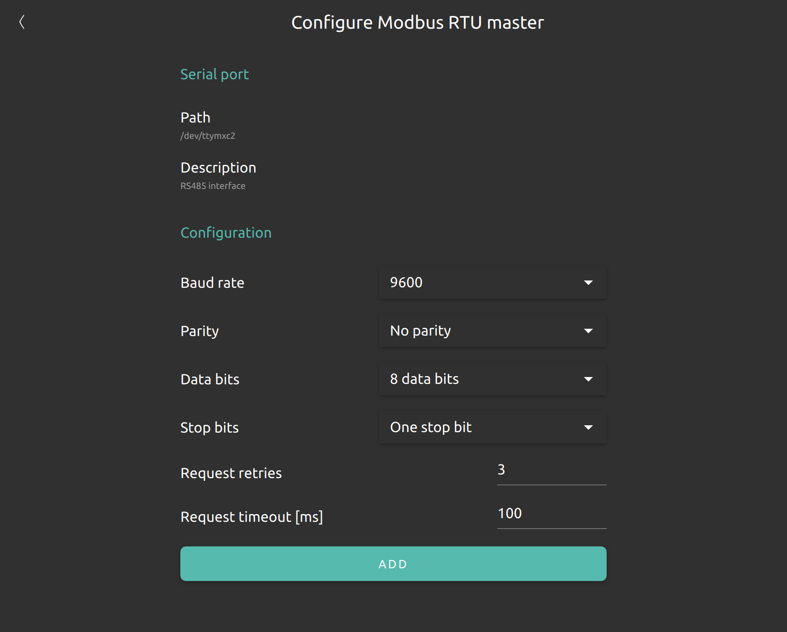

Once the modbus RTU master has been set up, new modbus RTU devices can be added by configuring new things in nymea. While adding new modbus RTU things you can specify on which modbus slave ID and on which modbus RTU master the device can be found.

.. note::

   If you remove and re-add the modbus RTU master, you need to reconfigure all modbus things which have been configured using the old, removed modbus RTU master. The devices will not be able to communicate until a new modbus RTU master has been assigned to them.

Static modbus RTU platform configuration
----------------------------------------

For platform maintainers there is an optional static configuration file which can be used for filtering out internal serial interfaces (i.e. HCI-UART or serial tty communication).

The name of the file has to be ``/var/lib/nymea/modbus-rtu-platform.conf`` and the format looks like
the following:

.. note::

   Only existing interfaces will be interpreted or filtered.

.. code-block:: json

   {
       "interfaces" : [
           {
               "name": "ttymxc0",
               "description": "Debug UART",
               "serialPort": "/dev/ttymxc0",
               "usable": false
           },
           {
               "name": "ttymxc1",
               "description": "BT HCI-UART",
               "serialPort": "/dev/ttymxc1",
               "usable": false
           },
           {
               "name": "ttymxc2",
               "description": "RS485 interface",
               "serialPort": "/dev/ttymxc2",
               "usable": true
           }
       ]
   }

If a serial port is marked as ``"usable": false`` it will be filtered out and cannot be added as modbus RTU resource. If the port is marked as ``"usable": true``, the description of the configuration file will be shown to the user in the app.

Plugins
-------

This section lists all the installed integration plugins. Some integration plugins may offer a plugin wide configuration which can be accessed here.

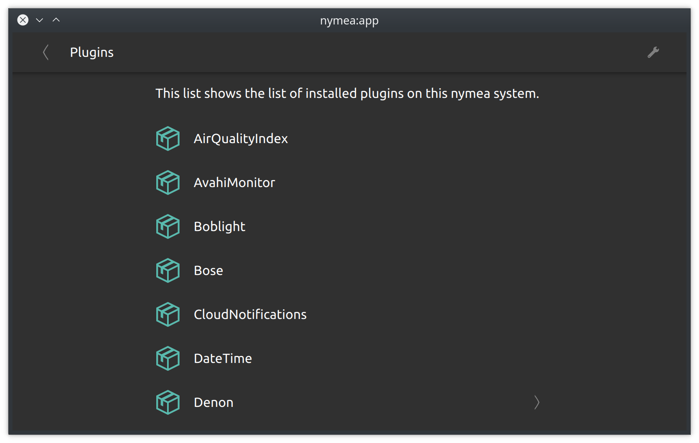

Developer tools
---------------

The developer tools section hosts options specific to development and trouble shooting.

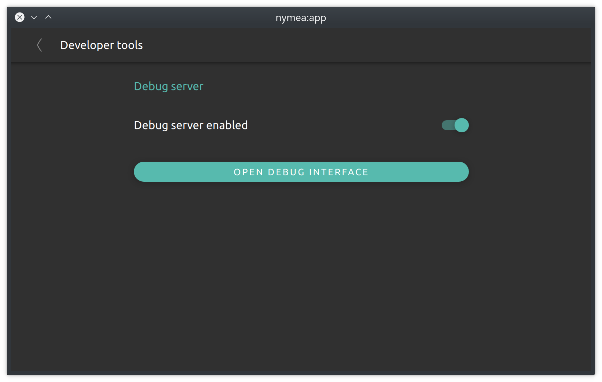

Debug interface
---------------

When the debug interface is enabled, it will be served on all the enabled `web server <#web-server>`__ interfaces. The debug interface allows to inspect system logs and create debug information bundles that can be submitted to developers to help with development.

System update
-------------

This section allows to update the nymea:core system as well as installing more plugins.

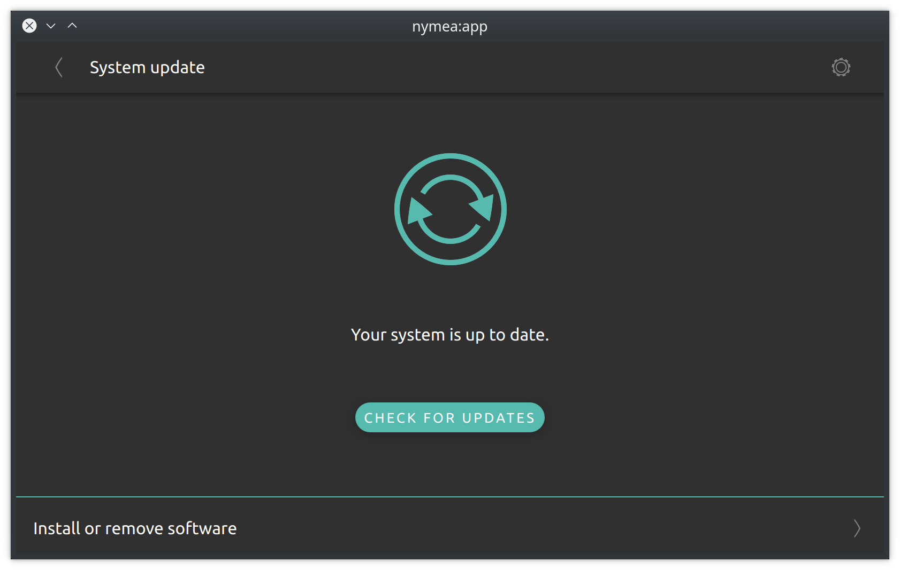

When system updates are available, they will be listed here and can be updated individually or all at once. It is recommended to update all at once for most users.

Testing and experimental
------------------------

For users that want to test pre-releases of nymea software, the configuration button on the upper right allows to enable additional repositories.

.. note::

   Please be aware that using testing or experimental repositories is likely to introduce issues into a nymea system occasionally. Please only enable those sections if acknowledging this and being ready to repair things.

Log viewer
----------

The log viewer shows everything that happens in the nymea system. Every button press, every sensor state change and such will be logged in here and can be inspected at a later point. This is useful when tracing down unexpected behavior, for instance if smart rules or scripts are not behaving as expected.

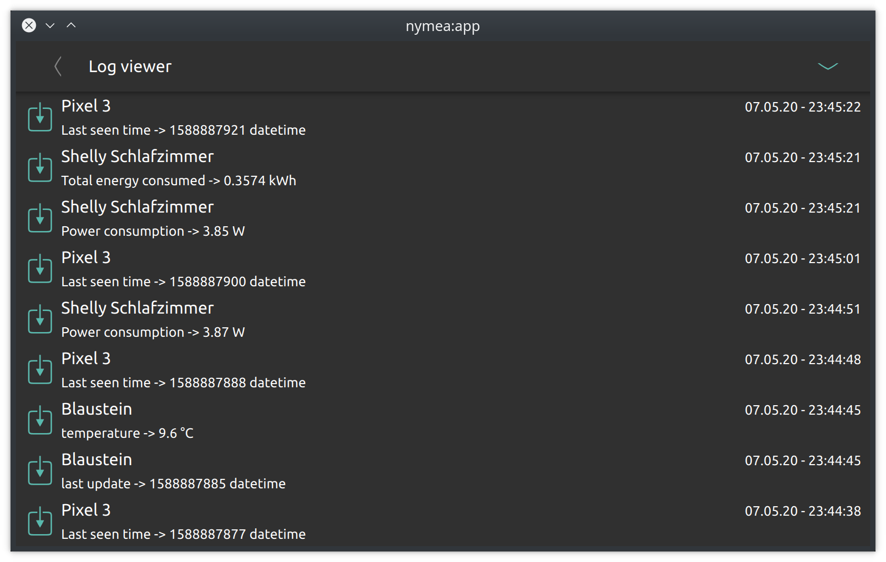

About nymea:core
----------------

The last section in the system settings shows version numbers, license information and other useful details that might be of interest when reporting issues.

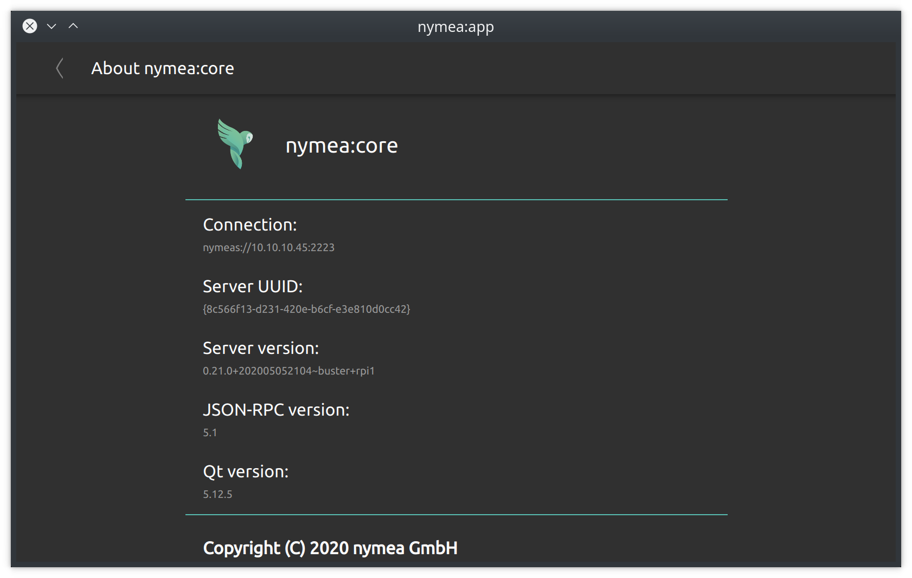
