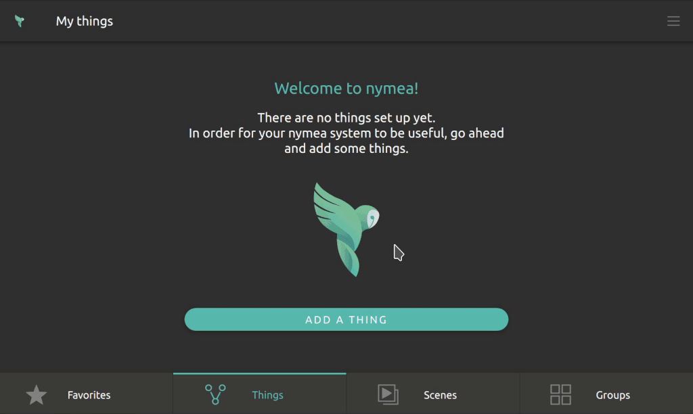
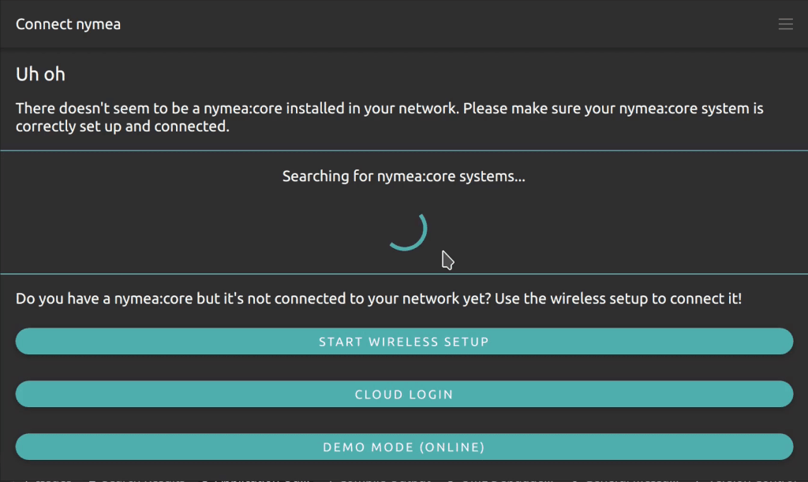
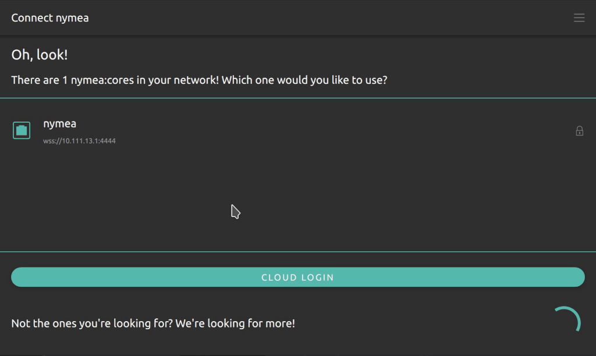

.. _doc-users-usage-first-steps:

First steps
===========

At this point, nymea:core should be installed on one device and nymea:app should be available on one or
more devices such as smartphones or desktop PCs. Refer back to the installation pages if anything is
missing.

Connect the app
---------------

Connect nymea:core to the local network first. A LAN cable is the simplest option. If the device has no
LAN port, set up Wi-Fi during the initial setup.

Open nymea:app and connect to the nymea:core system. If the core runs on the same local network, it
should appear automatically. If the system is headless, nymea:app can also set up Wi-Fi over Bluetooth.

When Bluetooth setup is used, open the *Wireless setup* menu, select ``BT WLAN Setup``, choose the Wi-Fi
network and enter the password.

Create the first user
---------------------

When connecting for the first time, nymea:app asks for a username and password. Enter your email address
as the username and choose a new password.

