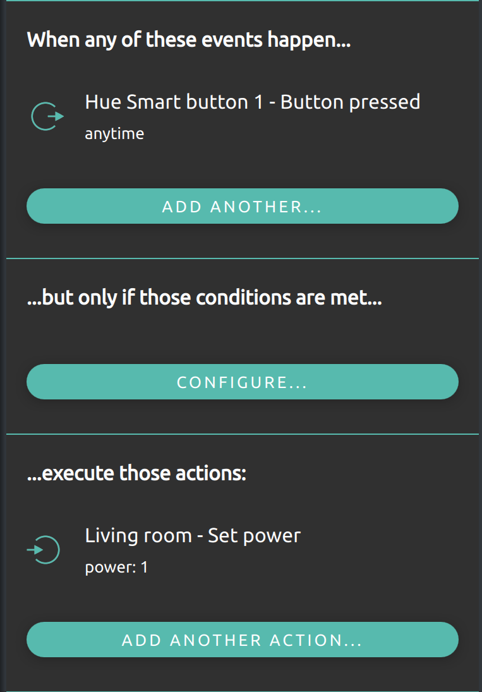
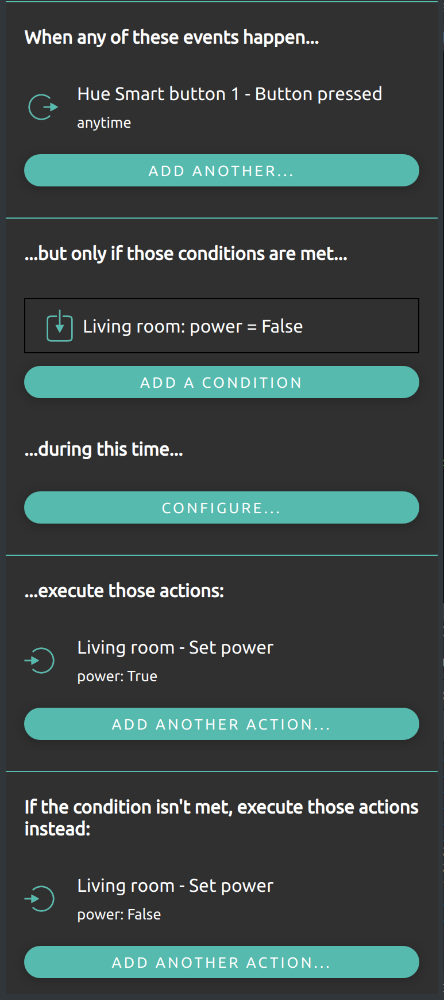
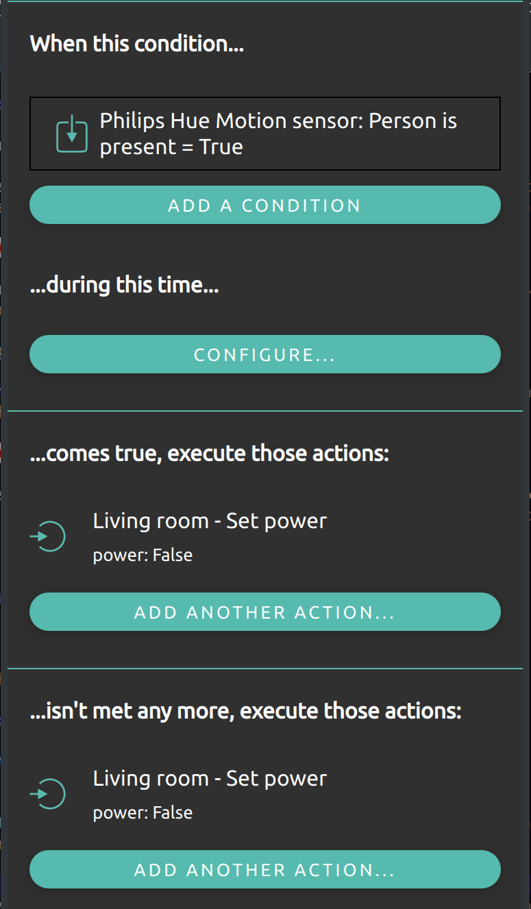
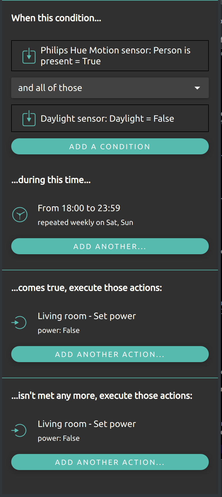

.. _doc-users-usage-rules:

Smart rules
===========

Rule engine
-----------

Rules can be used to add smart behavior to a nymea setup by composing the behavior in the app. Rules
define what should happen when a condition is met or when an event happens in the system. Whenever a
condition described in the rule is met, a set of actions is executed.

In order to add rules, enter the "Magic" page in nymea:app and press the ``+`` button on the upper right.

Event based rules
-----------------

Event based rules contain one or more event descriptions. They are evaluated every time one of the
contained event descriptions matches an event happening in the system. Such rules may still evaluate
other states in the system before executing any actions.

Event based examples
--------------------

* Turning on a light when a button is pressed

  
This is the simplest form of a rule. The rule will be evaluated every time the Hue smart button is
pressed. Given it does not have any conditions defined, it will immediately advance to the actions to be
executed. In this example that would turn on the living room light.
  

  
There can also be multiple buttons assigned to the events in a rule to allow multiple buttons to turn on
the light. The rule will be evaluated every time one of the events happens in the system.
  
* Toggling a light

Similar to the above, a rule can also evaluate a state in the system and execute different actions based
on that. This comes in handy when defining a light toggle, for example.
  

  
This rule would be evaluated whenever the Hue smart button is pressed. The evaluation would check whether
the living room light is off (Power = False). If so, it would trigger the action that would turn the
living room light on. If the condition is not met (e.g. living room power is True), it would instead
execute the alternative action set which would turn the light off.
  

State based rules
-----------------

State based rules are rules which only contain conditions and actions. Each time a state contained in the
rule condition changes in the system, the rule is evaluated. That means, all the conditions defined in
the rule are examined. If all conditions are met, the rule actions are executed. Those kinds of rules are especially useful when binding
two things together.

State based examples
--------------------

* Controlling a light with a motion sensor

For example, if a light should be turned on and off by a motion sensor, this could be defined with event
based rules. However, it would require two rules: one that turns the light on when the motion sensor
detects the presence of a person, and a second that turns the light off when the motion sensor reports
that the person has left. Using a state based rule instead, this can be done in a single simple rule:

  
This rule would be active while a motion sensor reports the presence of a person. When this state is
entered, the defined actions will be executed and the light is turned on. When the condition is not met
anymore, the alternative actions are executed and the light is turned off again.
  
* More advanced conditions

Conditions can be much more advanced than the previous examples. To build on the previous example with
the motion sensor turning on a light, the following example would do the same but only if the daylight
sensor reports that it is already dark, and only on weekends before midnight.
  

